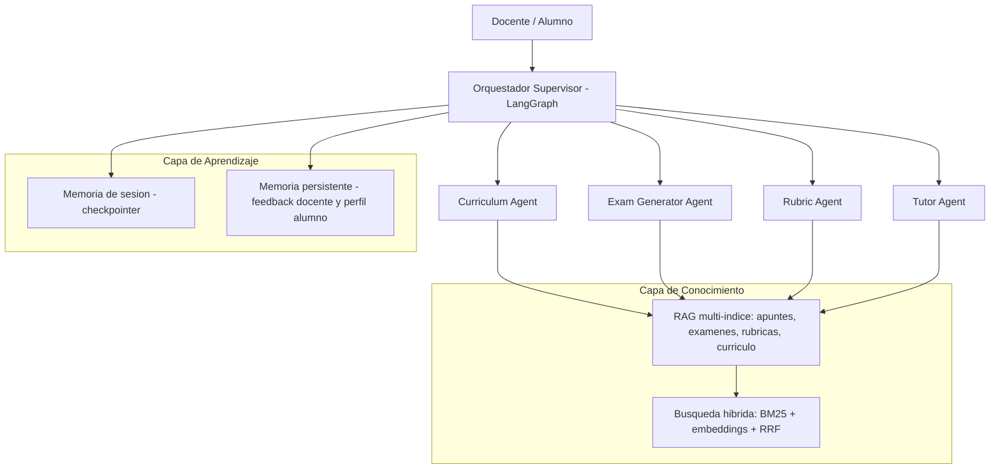
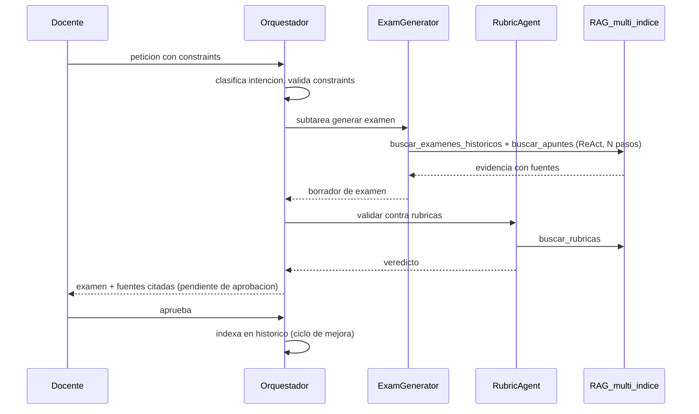

# Asistente IA para Educación — Documento de Arquitectura

Sistema multi-agente (Agentic AI) que asiste a docentes y alumnado de un instituto,
apoyado en la base documental interna (apuntes, PDFs, exámenes antiguos, rúbricas y
currículo oficial) mediante RAG multi-índice con búsqueda híbrida.

Fundamentos teóricos:

- **Sapkota, Roumeliotis & Karkee (2025), "AI Agents vs. Agentic AI"** (Information Fusion 126):
  taxonomía que distingue AI Agents (sistemas de entidad única, tool-augmented) de Agentic AI
  (ecosistemas orquestados de agentes especializados con descomposición dinámica de tareas,
  memoria persistente y autonomía coordinada).
- **Yang et al. (2025), "A Survey of AI Agent Protocols"** (arXiv:2504.16736): clasificación de
  protocolos de comunicación en contexto-orientados (agente ↔ recursos, p. ej. MCP) e
  inter-agente (agente ↔ agente, p. ej. A2A, ANP), claves para escalar soluciones basadas en agentes.

## 1. Clasificación del sistema

Según la taxonomía de Sapkota et al., este sistema es **Agentic AI**, no un AI Agent aislado:

| Criterio | Este sistema |
|---|---|
| Arquitectura | Múltiples agentes especializados + orquestador (no una entidad única) |
| Descomposición de tareas | El orquestador enruta y descompone la petición en subtareas |
| Memoria | Persistente y compartida (sesión + largo plazo) |
| Coordinación | Validación cruzada entre agentes (Rubric revisa a Exam Generator) |
| Autonomía | Coordinada, con human-in-the-loop del docente |

## 2. Directrices de Orquestación

### 2.1 Patrón supervisor

Un grafo LangGraph actúa como **orquestador supervisor**: recibe la petición, clasifica la
intención (docente o alumno; planificar, examinar, evaluar o tutorizar) y enruta al agente
especializado. Cada agente es un subgrafo con sus propias tools. Esto materializa el
"meta-agente de coordinación" que el paper de taxonomía identifica como rasgo definitorio
de Agentic AI.

### 2.2 Ciclo ReAct por agente

Cada agente opera en bucle **ReAct** (razonar → llamar tool → observar → iterar). El
requerimiento pide "varios pasos de razonamiento y llamadas a herramientas" consultando
hasta 10 fuentes internas: el bucle ReAct con límite de iteraciones lo implementa de forma
natural y acotada.

### 2.3 Estado compartido tipado

El estado del grafo (TypedDict) transporta entre nodos:

- la petición original y el rol del usuario (docente/alumno),
- el agente destino decidido por el router,
- la evidencia recuperada (con metadatos de fuente) para trazabilidad,
- los borradores intermedios (p. ej. examen generado pendiente de validación),
- el veredicto de validación cruzada.

### 2.4 Protocolos para escalar (paper de protocolos)

- **MCP (contexto-orientado)**: las tools RAG se diseñan como funciones puras y
  autodescriptivas, listas para exponerse vía servidor MCP cuando se quiera compartir la capa
  de conocimiento con otros clientes/agentes. En el MVP se invocan in-process.
- **A2A (inter-agente)**: camino de evolución para interoperar con agentes de otros equipos o
  vendors (p. ej. un agente de secretaría académica). Se adoptan sus principios desde ya:
  seguridad por defecto, soporte de tareas de larga duración y agnosticismo de modalidad.

### 2.5 Mitigación de riesgos multi-agente

El paper de taxonomía identifica desafíos propios de Agentic AI (desalineación inter-agente,
propagación de errores, comportamiento emergente). Directrices adoptadas:

1. **Validación cruzada**: todo examen generado pasa por el Rubric Agent antes de entregarse.
2. **Límites de iteración** en cada bucle ReAct (evita bucles infinitos y coste descontrolado).
3. **Human-in-the-loop**: el docente aprueba el material antes de darlo por definitivo
   (interrupción del grafo previa al nodo final).
4. **Trazabilidad**: toda salida lista las fuentes internas consultadas.

## 3. Directrices de Conocimiento

### 3.1 Ingesta

Pipeline que procesa apuntes, PDFs y exámenes antiguos: carga → chunking → extracción de
metadatos (asignatura, curso, año, tipo de documento) → indexación.

### 3.2 RAG multi-índice

Cuatro índices separados, uno por tipo de fuente:

| Índice | Contenido | Consumidores principales |
|---|---|---|
| `apuntes` | Apuntes y material de clase | Tutor, Curriculum |
| `examenes` | Exámenes históricos | Exam Generator |
| `rubricas` | Rúbricas y criterios de evaluación | Rubric, Exam Generator |
| `curriculo` | Currículo oficial y programaciones | Curriculum |

Separar índices permite que cada agente consulte solo las fuentes pertinentes, con
recuperación más precisa que un índice monolítico.

### 3.3 Búsqueda híbrida

Cada consulta combina recuperación **léxica** (BM25, exacta en terminología: "ley de Ohm",
"sintaxis SQL") y **semántica** (embeddings, robusta a paráfrasis), fusionadas con
**Reciprocal Rank Fusion (RRF)**. Es la técnica que el paper de taxonomía propone (RAG)
como mitigación principal de la alucinación en ambos paradigmas.

### 3.4 Grounding estricto

Los agentes **no responden "en general"**: el system prompt de cada agente exige apoyarse en
la evidencia recuperada de la base documental del instituto y citar las fuentes. Si no hay
evidencia suficiente, el agente lo declara en lugar de inventar. Todo se genera alineado al
histórico del centro.

## 4. Directrices de Aprendizaje

### 4.1 Memoria de corto plazo (sesión)

**Checkpointer** de LangGraph: el estado de la conversación persiste por `thread_id`, dando
continuidad multi-turno (el docente refina el examen en varios turnos; el alumno mantiene
una sesión de tutoría).

### 4.2 Memoria de largo plazo

**Store** persistente con tres espacios:

- `feedback_docente`: exámenes aprobados/corregidos y observaciones; el histórico de lo que
  el centro considera "bueno".
- `perfil_alumno`: progreso, temas dominados y dificultades por alumno; el Tutor Agent adapta
  explicaciones a este perfil.
- `historico_generaciones`: material ya generado, para no repetir preguntas y mantener el
  estilo del centro.

### 4.3 Ciclo de mejora

El feedback del docente se reincorpora como conocimiento: un examen aprobado se indexa en
`examenes` y pasa a formar parte del histórico que condiciona generaciones futuras. Es el
mismo patrón de memoria persistente que el paper describe en el caso AutoGen/NSF
(borradores y feedback almacenados que permiten mejora iterativa entre sesiones).

## 5. Definición de los agentes

### 5.1 Curriculum Agent

- **Rol**: estructura contenidos en unidades didácticas y sesiones.
- **Tools**: `buscar_curriculo`, `buscar_apuntes`.
- **Entrada**: asignatura, curso, periodo, restricciones horarias.
- **Salida**: programación estructurada (unidades → sesiones → objetivos → materiales citados).

### 5.2 Exam Generator Agent

- **Rol**: crea exámenes bajo constraints validados (nº de preguntas, dificultad, temas,
  duración, tipos de pregunta).
- **Tools**: `buscar_examenes_historicos`, `buscar_apuntes`, `buscar_rubricas`.
- **Comportamiento**: cruza exámenes anteriores para mantener el estilo del centro y evitar
  repetir preguntas; adapta la dificultad al histórico.
- **Salida**: examen estructurado (Pydantic) con soluciones y fuentes; pasa a validación del
  Rubric Agent y luego a aprobación del docente.

### 5.3 Rubric Agent

- **Rol**: aplica y genera criterios de evaluación; valida material generado.
- **Tools**: `buscar_rubricas`, `buscar_curriculo`.
- **Salida**: veredicto de validación (aprobado / cambios requeridos con motivos) o rúbrica
  nueva alineada al currículo.

### 5.4 Tutor Agent

- **Rol**: cara al alumnado; explica conceptos con la base documental y se adapta al perfil
  del alumno (memoria de largo plazo).
- **Tools**: `buscar_apuntes`, `buscar_curriculo`.
- **Salvaguardas**: no resuelve exámenes activos ni entrega soluciones de evaluaciones;
  guía con preguntas y explicaciones referenciadas a los apuntes del centro.

## 6. Flujo de ejemplo: "Genera un examen de 10 preguntas sobre electricidad"

## 7. Stack técnico

| Capa | Elección | Motivo |
|---|---|---|
| Orquestación | LangGraph | Control fino de grafo, estado, checkpointing e interrupciones |
| Agentes | LangChain (ReAct) | Bucle razonamiento-tool estándar |
| Vector store | ChromaDB local | MVP sin infraestructura externa; migrable |
| Léxico | rank-bm25 | Búsqueda híbrida |
| LLM | OpenAI (configurable) | Vía `langchain-openai`; intercambiable por proveedor compatible |
| Validación | Pydantic | Constraints de examen tipados |
