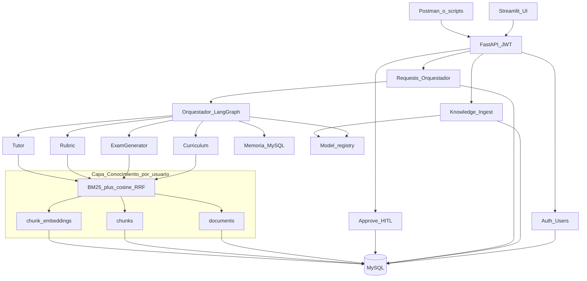
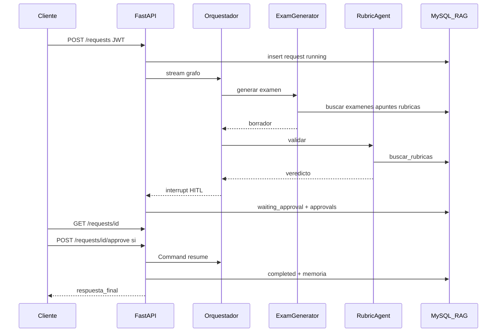

# Asistente IA para Educación — Documento de Arquitectura

Sistema multi-agente (Agentic AI) que asiste a docentes y alumnado, con
**conocimiento RAG privado por usuario**, expuesto mediante **API REST**
autenticada (JWT) y persistido en **MySQL**.

Fundamentos teóricos:

- **Sapkota, Roumeliotis & Karkee (2025), "AI Agents vs. Agentic AI"** (Information Fusion 126):
  taxonomía que distingue AI Agents (sistemas de entidad única, tool-augmented) de Agentic AI
  (ecosistemas orquestados de agentes especializados con descomposición dinámica de tareas,
  memoria persistente y autonomía coordinada).
- **Yang et al. (2025), "A Survey of AI Agent Protocols"** (arXiv:2504.16736): clasificación de
  protocolos de comunicación en contexto-orientados (agente ↔ recursos, p. ej. MCP) e
  inter-agente (agente ↔ agente, p. ej. A2A, ANP), claves para escalar soluciones basadas en agentes.

## 1. Clasificación del sistema

Según la taxonomía de Sapkota et al., este sistema es **Agentic AI**, no un AI Agent aislado:

| Criterio | Este sistema |
|---|---|
| Arquitectura | Múltiples agentes especializados + orquestador (no una entidad única) |
| Descomposición de tareas | El orquestador enruta y descompone la petición en subtareas |
| Memoria | Persistente por usuario (sesión + largo plazo en MySQL) |
| Coordinación | Validación cruzada entre agentes (Rubric revisa a Exam Generator) |
| Autonomía | Coordinada, con human-in-the-loop del docente vía API |
| Multitenancy de conocimiento | Base documental **aislada por `user_id`** |

## 2. Capa de exposición (backend-first)

El camino estable de consumo es la **API REST** (`src/api/`). El cliente de referencia
es Streamlit (`app_streamlit/`), que solo llama HTTP con JWT (sin embeber el grafo ni
el RAG). El CLI (`main.py`) y `src/legacy_chat_api.py` quedan como legado opcional.

| Área | Endpoints | Notas |
|---|---|---|
| Auth | `POST /auth/register`, `/login`, `GET /auth/me` | JWT Bearer; roles `docente` / `alumno` |
| Conocimiento | `/knowledge/...` | CRUD docs + ingest/reprocess scoped al usuario |
| Solicitudes | `POST/GET /requests`, `/approve`, `/events` | Orquestador async + HITL |
| Salud | `GET /health` | Liveness + `llm` del registry |

**UI Streamlit** (`streamlit run app_streamlit/Home.py`): Home (login), Conocimiento,
Asistente (polling), Historial, Aprobaciones (docente). Variable `STREAMLIT_API_BASE_URL`.

Aislamiento: **todo filtrado por `user_id` del JWT**. Un usuario no ve documentos,
chunks ni solicitudes de otro.

## 3. Directrices de Orquestación

### 3.1 Patrón supervisor

Un grafo LangGraph actúa como **orquestador supervisor**: recibe la petición, clasifica la
intención (docente o alumno; planificar, examinar, evaluar o tutorizar) y enruta al agente
especializado. Cada agente es un subgrafo con sus propias tools.

- Alumno → siempre `tutor` (regla de salvaguarda, sin LLM en el router).
- Docente → clasificación LLM estructurada (`DecisionRouter`).

### 3.2 Ciclo ReAct por agente

Cada agente opera en bucle **ReAct** (razonar → llamar tool → observar → iterar), con
límite de iteraciones (`MAX_ITERACIONES_REACT`) para acotar coste y bucles.

### 3.3 Estado compartido tipado

El estado del grafo transporta: petición, rol, `alumno_id`, agente destino, borradores
legibles y **contratos Pydantic** (`constraints`, `examen`, `veredicto`) serializados
como dict. El LLM puede cambiar; el routing (p. ej. regenerar vs HITL) usa campos
tipados (`veredicto.aprobado`), no substrings del texto libre. Si la salida del LLM
no valida, `safe_parse` aplica un fallback seguro para no corromper la solicitud.
En API, el `thread_id` de la solicitud permite
reanudar el HITL entre llamadas HTTP.

### 3.4 Protocolos para escalar

- **MCP (contexto-orientado)**: tools RAG como funciones puras/autodescriptivas, listas para
  servidor MCP. Hoy se invocan in-process con `user_id` en ContextVar.
- **A2A (inter-agente)**: camino de evolución; se mantienen principios de seguridad y tareas
  de larga duración (status `running` / `waiting_approval` / `completed`).

### 3.5 Mitigación de riesgos multi-agente

1. **Validación cruzada**: todo examen pasa por el Rubric Agent.
2. **Límites de iteración** en cada bucle ReAct.
3. **Human-in-the-loop**: `interrupt` → `waiting_approval` → `POST /requests/{id}/approve`.
4. **Trazabilidad**: fuentes citadas + `request_events` + LangSmith opcional.

## 4. Directrices de Conocimiento

### 4.1 Modelo de persistencia (MySQL)

La fuente de verdad del conocimiento **no** es el filesystem ni Chroma en el flujo API:

| Entidad | Tabla | Rol |
|---|---|---|
| Documento | `documents` | Texto + metadatos + status (`pending`/`indexed`/`error`) |
| Fragmentos | `chunks` | Texto troceado por `user_id` + índice |
| Vectores | `chunk_embeddings` | Embedding JSON + modelo/dims |

Ingesta a demanda: `POST /knowledge/ingest` o `/documents/{id}/reprocess`
(chunking → `get_embeddings()` del registry → upsert MySQL). Embeddings de distintos
modelos pueden coexistir; la búsqueda semántica filtra por `chunk_embeddings.model`.

### 4.2 RAG multi-índice (por usuario)

Cuatro índices lógicos; el contenido es **privado por usuario**:

| Índice | Contenido | Consumidores principales |
|---|---|---|
| `apuntes` | Apuntes y material de clase | Tutor, Curriculum |
| `examenes` | Exámenes históricos | Exam Generator |
| `rubricas` | Rúbricas y criterios | Rubric, Exam Generator |
| `curriculo` | Currículo y programaciones | Curriculum |

### 4.3 Búsqueda híbrida

- **Léxico**: BM25 sobre chunks del usuario/índice (en memoria a demanda).
- **Semántico**: embedding de consulta + similitud coseno contra `chunk_embeddings`.
- **Fusión**: Reciprocal Rank Fusion (RRF).

Implementación: `src/rag/mysql_store.py` + tools en `src/rag/tools.py` (scoped por ContextVar).

### 4.4 Grounding estricto

Los agentes no responden "en general": deben apoyarse en la KB del usuario y citar fuentes.
Si no hay evidencia, lo declaran.

## 5. Directrices de Aprendizaje

### 5.1 Memoria de corto plazo (sesión)

Checkpointer de LangGraph por `thread_id` (= id de solicitud API), necesario para reanudar
el HITL tras `interrupt`.

### 5.2 Memoria de largo plazo (MySQL)

| Espacio | Tabla | Uso |
|---|---|---|
| Feedback docente | `memory_feedback` | Decisiones de aprobación |
| Perfil alumno | `memory_perfil_alumno` | Adaptación del Tutor |
| Histórico generaciones | `memory_historico` | Material aprobado |

### 5.3 Ciclo de mejora

Al aprobar un examen se persiste feedback e histórico. La reindexación automática del
examen aprobado en el índice `examenes` del usuario es evolución prevista (hook listo vía
pipeline de ingest).

## 6. Definición de los agentes

### 6.1 Curriculum Agent

- **Rol**: estructura contenidos en unidades y sesiones.
- **Tools**: `buscar_curriculo`, `buscar_apuntes`.
- **Salida**: programación estructurada con materiales citados.

### 6.2 Exam Generator Agent

- **Rol**: crea exámenes bajo constraints (nº preguntas, dificultad, temas, duración).
- **Tools**: `buscar_examenes_historicos`, `buscar_apuntes`, `buscar_rubricas`.
- **Salida**: examen + solucionario + fuentes → validación Rubric → HITL docente.

### 6.3 Rubric Agent

- **Rol**: valida material con contrato `VeredictoValidacion` (`aprobado` bool) o genera rúbricas.
- **Tools**: `buscar_rubricas`, `buscar_curriculo`.

### 6.4 Tutor Agent

- **Rol**: explica al alumnado con la KB del usuario y el perfil.
- **Tools**: `buscar_apuntes`, `buscar_curriculo`.
- **Salvaguardas**: no resuelve exámenes activos.

## 7. Flujo de ejemplo: generar examen (API)

## 8. Stack técnico

| Capa | Elección | Motivo |
|---|---|---|
| API | FastAPI + Uvicorn | OpenAPI nativo, async, CORS para frontend |
| Auth | JWT (python-jose) + passlib/bcrypt | Roles docente/alumno |
| Persistencia | MySQL (SQLAlchemy) | Usuarios, KB, requests, memoria |
| Orquestación | LangGraph | Grafo, checkpoint, interrupt HITL |
| Agentes | LangChain ReAct | Razonamiento + tools |
| RAG | BM25 + embeddings (OpenAI u Ollama) + RRF sobre MySQL | Filtra por `chunk_embeddings.model` |
| LLM | Model registry (`LLM_PROFILE`) | OpenAI cloud o Ollama local |
| UI | Streamlit (`app_streamlit/`) | Cliente HTTP JWT, sin embeber el grafo |
| Observabilidad | JSONL local + LangSmith opcional | Depuración y coste |
| Validación | Pydantic | Schemas API y contratos entre agentes |
| Pruebas | `scripts/run_test_pipeline.py` + pytest | Smoke y contratos |

### Model registry

`src/llm/registry.py` centraliza chat y embeddings. Perfiles:

| Perfil | Chat | Embeddings |
|---|---|---|
| `cloud_openai` (default) | `gpt-4o-mini` | `text-embedding-3-small` |
| `local_barato` | Ollama `qwen2.5:3b` | Ollama `nomic-embed-text` |
| `local_calidad` | Ollama `qwen2.5:7b` | Ollama `nomic-embed-text` |

Prioridad de resolución: argumento > env (`LLM_MODEL`, …) > perfil. Ollama usa el endpoint compatible OpenAI (`OLLAMA_BASE_URL`). La búsqueda semántica solo compara embeddings del modelo activo; se pueden almacenar varios modelos en MySQL sin mezclarlos en cosine.

`GET /health` expone la selección activa vía `describe_llm()`.

## 9. Despliegue y configuración

Variables clave en `.env`:

- `LLM_PROFILE` (`cloud_openai` \| `local_barato` \| `local_calidad`)
- Overrides opcionales: `LLM_PROVIDER`, `LLM_MODEL`, `EMBEDDING_PROVIDER`, `EMBEDDING_MODEL`, `OLLAMA_BASE_URL`
- `OPENAI_API_KEY` (requerido en perfil cloud)
- `DATABASE_URL` (MySQL remoto)
- `JWT_SECRET`, `JWT_EXPIRE_MINUTES`
- `CORS_ORIGINS`
- `STREAMLIT_API_BASE_URL` (cliente UI)
- LangSmith opcional: `LANGCHAIN_TRACING_V2`, `LANGCHAIN_API_KEY`, `LANGCHAIN_PROJECT`

Inicialización: `python scripts/init_db.py`. Seed demo: `python scripts/seed_demo_kb.py`.

## 10. Diagramas adicionales

- [diagramas-secuencia.md](diagramas-secuencia.md) — auth, ingest, tutoría, examen HITL, aislamiento
- [c4/](c4/) — arquitectura C4 (contexto, contenedores, componentes, código)

