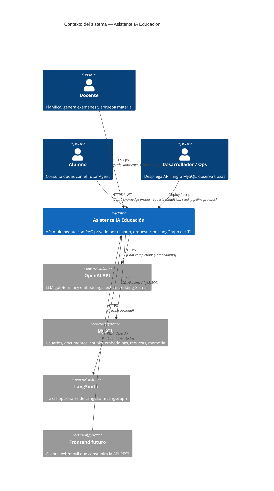

# C4 Nivel 1 — Contexto del sistema

Vista de personas y sistemas externos que interactúan con el Asistente IA para Educación.

## Alcance

- **Dentro del sistema:** API FastAPI, orquestador LangGraph, agentes ReAct, retriever híbrido, lógica de ingest.
- **Fuera del sistema:** OpenAI, MySQL gestionado, LangSmith, clientes (hoy curl/Postman/scripts; mañana frontend).

## Decisiones de contexto

1. El conocimiento es **por usuario**, no un corpus institucional compartido.
2. El backend es el producto estable; el frontend se construye después sobre OpenAPI.
3. MySQL es la fuente de verdad de KB y gestión (no Chroma en el flujo API).
