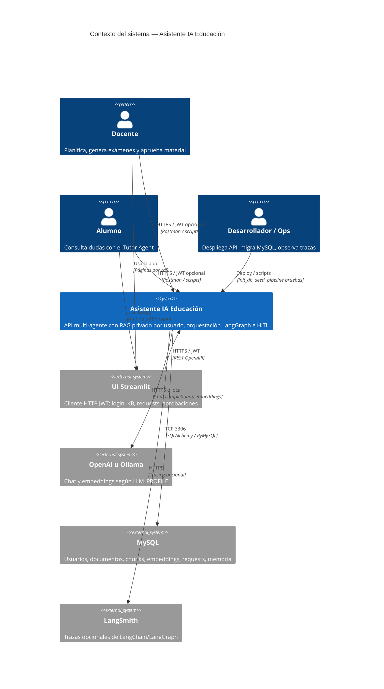

# C4 Nivel 1 — Contexto del sistema

Vista de personas y sistemas externos que interactúan con el Asistente IA para Educación.

## Alcance

- **Dentro del sistema:** API FastAPI, orquestador LangGraph, agentes ReAct, retriever híbrido MySQL, ingest, model registry.
- **Fuera del sistema:** OpenAI/Ollama, MySQL gestionado, LangSmith, UI Streamlit (proceso aparte), Postman/scripts.

## Decisiones de contexto

1. El conocimiento es **por usuario**, no un corpus institucional compartido.
2. El backend es el producto estable; Streamlit es un **cliente** (no embebe LangGraph/RAG).
3. MySQL es la fuente de verdad de KB y gestión (no Chroma en el flujo API).
4. El proveedor LLM es intercambiable vía `LLM_PROFILE` sin cambiar contratos de agentes.
