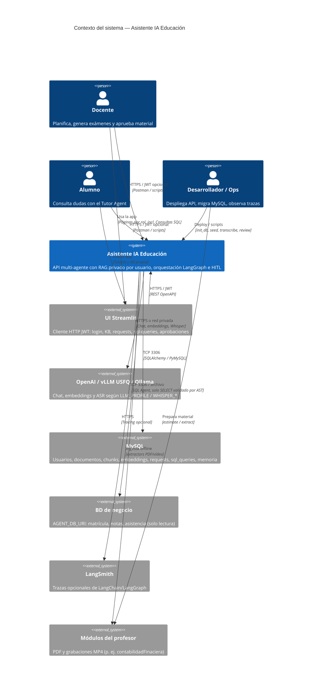

# C4 Nivel 1 — Contexto del sistema

Vista de personas y sistemas externos que interactúan con el Asistente IA para Educación.

```mermaid
C4Context
title Contexto del sistema — Asistente IA Educación

Person(docente, "Docente", "Planifica, genera exámenes y aprueba material")
Person(alumno, "Alumno", "Consulta dudas con el Tutor Agent")
Person(dev, "Desarrollador / Ops", "Despliega API, migra MySQL, observa trazas")

System(asistente, "Asistente IA Educación", "API multi-agente con RAG privado por usuario, orquestación LangGraph e HITL")

System_Ext(ui, "UI Streamlit", "Cliente HTTP JWT: login, KB, requests, sql-queries, aprobaciones")
System_Ext(llmprov, "OpenAI / vLLM USFQ / Ollama", "Chat, embeddings y ASR según LLM_PROFILE / WHISPER_*")
System_Ext(mysql, "MySQL", "Usuarios, documentos, chunks, embeddings, requests, sql_queries, memoria")
System_Ext(bizdb, "BD de negocio", "AGENT_DB_URI: matrícula, notas, asistencia (solo lectura)")
System_Ext(langsmith, "LangSmith", "Trazas opcionales de LangChain/LangGraph")
System_Ext(modulos, "Módulos del profesor", "PDF y grabaciones MP4 (p. ej. contabilidadFinaciera)")

Rel(docente, ui, "Usa la app", "Páginas por rol, incl. Consultas SQL")
Rel(alumno, ui, "Usa la app", "Tutoría y KB propia")
Rel(ui, asistente, "HTTPS / JWT", "REST OpenAPI")
Rel(docente, asistente, "HTTPS / JWT opcional", "Postman / scripts")
Rel(alumno, asistente, "HTTPS / JWT opcional", "Postman / scripts")
Rel(dev, asistente, "Deploy / scripts", "init_db, seed, transcribe, review")
Rel(dev, modulos, "Prepara material", "estimate / extract")
Rel(asistente, modulos, "Ingesta offline", "extractors PDF/vídeo")
Rel(asistente, llmprov, "HTTPS o red privada", "Chat, embeddings, Whisper")
Rel(asistente, mysql, "TCP 3306", "SQLAlchemy / PyMySQL")
Rel(asistente, bizdb, "TCP 3306 / archivo", "SQL Agent, solo SELECT validado por AST")
Rel(asistente, langsmith, "HTTPS", "Tracing opcional")
```

## Alcance

- **Dentro del sistema:** API FastAPI, orquestador LangGraph, agentes ReAct, SQL Agent
  (`src/sql_agent/`), retriever híbrido MySQL, ingest, extractores de medios, model registry.
- **Fuera del sistema:** OpenAI / vLLM USFQ / Ollama, Whisper u ASR compatible, MySQL gestionado,
  la BD de negocio del SQL Agent, LangSmith, UI Streamlit (proceso aparte), carpetas de módulos
  del profesor, Postman/scripts.

## Decisiones de contexto

1. El conocimiento es **por usuario**, no un corpus institucional compartido.
2. El backend es el producto estable; Streamlit es un **cliente** (no embebe LangGraph/RAG).
3. MySQL es la fuente de verdad de KB y gestión (no Chroma en el flujo API).
4. El proveedor LLM/ASR es intercambiable vía `LLM_PROFILE` / `WHISPER_*` sin cambiar contratos de agentes.
5. Los módulos del profesor (PDF/vídeo) se normalizan a texto antes del ingest MySQL.
6. La BD de negocio del SQL Agent (`AGENT_DB_URI`) es **distinta** de la BD de metadatos
   (`DATABASE_URL`) e institucional, no por usuario; el acceso se restringe por rol
   (`docente`), no por aislamiento de datos entre usuarios.
