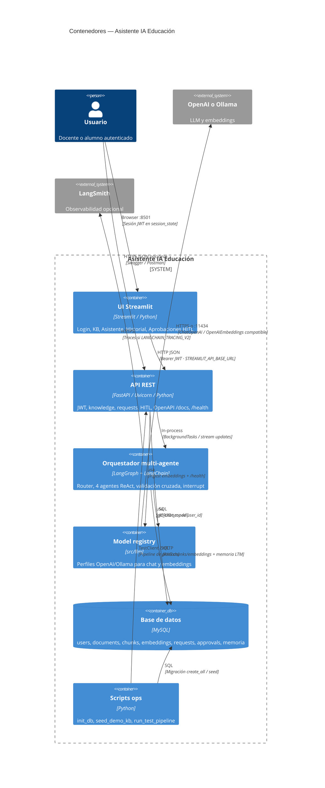

# C4 Nivel 2 — Contenedores

Aplicaciones y almacenes desplegables que forman el sistema.

## Responsabilidades

| Contenedor | Responsabilidad | Tecnología |
|------------|-----------------|------------|
| UI Streamlit | Presentación y flujos de usuario | Streamlit + httpx |
| API REST | Auth, contratos HTTP, aislamiento JWT, jobs | FastAPI |
| Orquestador | Clasificación, agentes, HITL, grounding | LangGraph |
| Model registry | Selección de chat/embeddings | `src/llm/registry.py` |
| MySQL | Persistencia de identidad, KB y solicitudes | MySQL remoto |
| Scripts | Bootstrap y validación | Python CLI |

## Notas de despliegue

- API y orquestador corren **en el mismo proceso** (Uvicorn, contenedor API).
- Streamlit es un **contenedor/proceso aparte** (`:8501`); solo habla HTTP con la API.
- En VPS / Compose ambos comparten imagen Docker y red interna; la UI usa
  `STREAMLIT_API_BASE_URL` apuntando al nombre del contenedor/servicio API.
- MySQL es **remoto** (`DATABASE_URL`).
- Script: `./scripts/remote.sh deploy|restart|health` (API + UI).
- Escalado futuro: workers separados + checkpointer durable compartido + cola (Redis/Celery).
