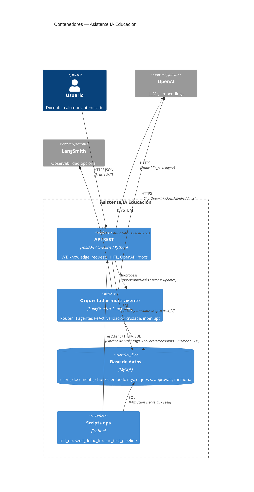

# C4 Nivel 2 — Contenedores

Aplicaciones y almacenes desplegables que forman el sistema.

## Responsabilidades

| Contenedor | Responsabilidad | Tecnología |
|------------|-----------------|------------|
| API REST | Auth, contratos HTTP, aislamiento JWT, disparo de jobs | FastAPI |
| Orquestador | Clasificación, agentes, HITL, grounding | LangGraph |
| MySQL | Persistencia de identidad, KB y solicitudes | MySQL remoto |
| Scripts | Bootstrap y validación | Python CLI |

## Notas de despliegue

- Hoy API y orquestador corren **en el mismo proceso** (Uvicorn).
- MySQL es **remoto** (`DATABASE_URL`).
- Escalado futuro: workers separados + checkpointer durable compartido + cola (Redis/Celery).
