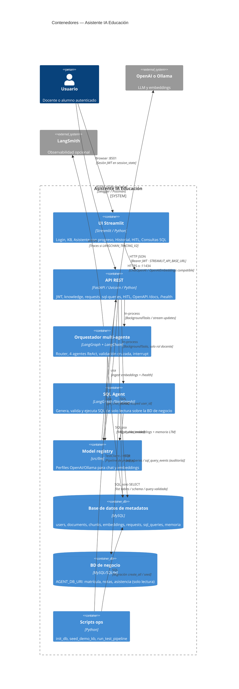

# C4 Nivel 2 — Contenedores

Aplicaciones y almacenes desplegables que forman el sistema.

```mermaid
C4Container
title Contenedores — Asistente IA Educación

Person(usuario, "Usuario", "Docente o alumno autenticado")

System_Boundary(sys, "Asistente IA Educación") {
    Container(ui, "UI Streamlit", "Streamlit / Python", "Login, KB, Asistente con progreso, Historial, HITL, Consultas SQL")
    Container(api, "API REST", "FastAPI / Uvicorn / Python", "JWT, knowledge, requests, sql-queries, HITL, OpenAPI /docs, /health")
    Container(orq, "Orquestador multi-agente", "LangGraph + LangChain", "Router, 4 agentes ReAct, validación cruzada, interrupt")
    Container(sqlagent, "SQL Agent", "LangGraph (StateGraph)", "Genera, valida y ejecuta SQL de solo lectura sobre la BD de negocio")
    Container(registry, "Model registry", "src/llm", "Perfiles OpenAI/Ollama para chat y embeddings")
    ContainerDb(mysql, "Base de datos de metadatos", "MySQL", "users, documents, chunks, embeddings, requests, sql_queries, memoria")
    ContainerDb(bizdb, "BD de negocio", "MySQL/SQLite", "AGENT_DB_URI: matrícula, notas, asistencia (solo lectura)")
    Container(scripts, "Scripts ops", "Python", "init_db, seed_demo_kb, run_test_pipeline")
}

System_Ext(llmprov, "OpenAI o Ollama", "LLM y embeddings")
System_Ext(langsmith, "LangSmith", "Observabilidad opcional")

Rel(usuario, ui, "Browser :8501", "Sesión JWT en session_state")
Rel(ui, api, "HTTP JSON", "Bearer JWT · STREAMLIT_API_BASE_URL")
Rel(usuario, api, "HTTPS JSON opcional", "Swagger / Postman")
Rel(api, orq, "In-process", "BackgroundTasks / stream updates")
Rel(api, sqlagent, "In-process", "BackgroundTasks, solo rol docente")
Rel(api, mysql, "SQL", "CRUD scoped user_id")
Rel(orq, mysql, "SQL", "RAG chunks/embeddings + memoria LTM")
Rel(sqlagent, mysql, "SQL", "sql_queries / sql_query_events (auditoría)")
Rel(sqlagent, bizdb, "SQL, solo SELECT", "list tables / schema / query validada")
Rel(orq, registry, "usa", "get_chat_model")
Rel(sqlagent, registry, "usa", "get_chat_model")
Rel(api, registry, "usa", "ingest embeddings + /health")
Rel(registry, llmprov, "HTTPS o :11434", "ChatOpenAI / OpenAIEmbeddings compatible")
Rel(orq, langsmith, "HTTPS", "Traces si LANGCHAIN_TRACING_V2")
Rel(scripts, mysql, "SQL", "Migración create_all / seed")
Rel(scripts, api, "TestClient / HTTP", "Pipeline de pruebas")
```

## Responsabilidades

| Contenedor | Responsabilidad | Tecnología |
|------------|-----------------|------------|
| UI Streamlit | Presentación y flujos de usuario | Streamlit + httpx |
| API REST | Auth, contratos HTTP, aislamiento JWT, jobs | FastAPI |
| Orquestador | Clasificación, agentes, HITL, grounding | LangGraph |
| SQL Agent | NL→SQL con validación AST y gate de grounding | LangGraph (`src/sql_agent/`) |
| Model registry | Selección de chat/embeddings | `src/llm/registry.py` |
| MySQL (metadatos) | Persistencia de identidad, KB y solicitudes | MySQL remoto |
| BD de negocio | Datos académicos consultados por el SQL Agent | MySQL/SQLite (`AGENT_DB_URI`) |
| Scripts | Bootstrap y validación | Python CLI |

## Notas de despliegue

- API, orquestador y SQL Agent corren **en el mismo proceso** (Uvicorn, contenedor API);
  el SQL Agent no necesita un contenedor propio, solo `AGENT_DB_URI` en el `.env` del API.
- Streamlit es un **contenedor/proceso aparte** (`:8501`); solo habla HTTP con la API.
- En VPS / Compose ambos comparten imagen Docker y red interna; la UI usa
  `STREAMLIT_API_BASE_URL` apuntando al nombre del contenedor/servicio API.
- MySQL (metadatos) es **remoto** (`DATABASE_URL`); la BD de negocio (`AGENT_DB_URI`) puede
  ser cualquier BD SQLAlchemy-compatible (MySQL/MariaDB en producción, SQLite en pruebas).
- Script: `./scripts/remote.sh deploy|restart|health` (API + UI).
- Escalado futuro: workers separados + checkpointer durable compartido + cola (Redis/Celery).
