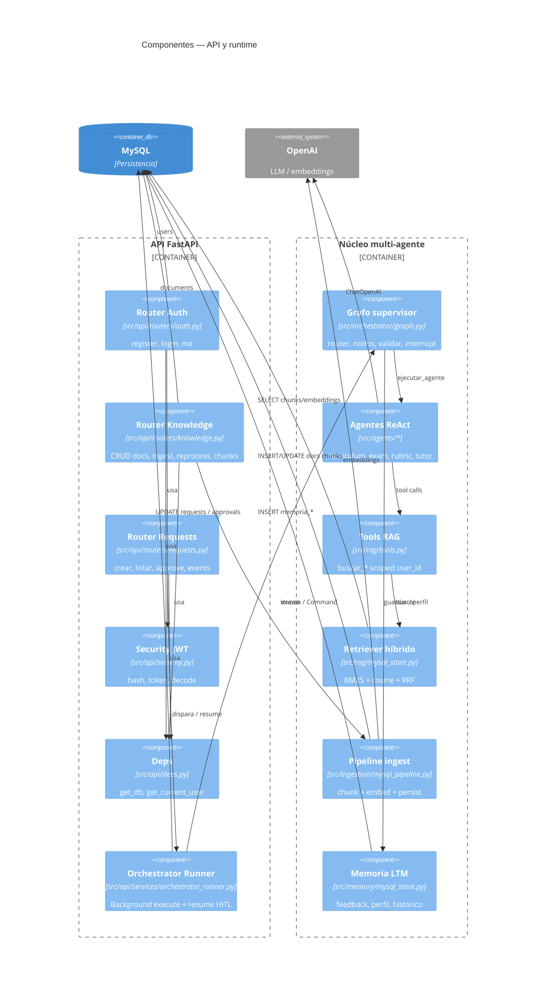

# C4 Nivel 3 — Componentes (API + orquestación)

Descomposición interna del contenedor API / runtime Python.

## Mapa componente → tablas MySQL

| Componente | Tablas principales |
|------------|-------------------|
| Auth | `users` |
| Knowledge / Ingest | `documents`, `chunks`, `chunk_embeddings` |
| Requests / Runner | `requests`, `request_events`, `approvals` |
| Memoria | `memory_feedback`, `memory_perfil_alumno`, `memory_historico` |

## ContextVar de aislamiento

Antes de ejecutar el grafo, el runner fija:

- `set_rag_user_id(user_id)` → tools RAG
- `set_memory_user_id(user_id)` → memoria LTM

Así el mismo código de agentes sirve a todos los usuarios sin mezclar KB.
