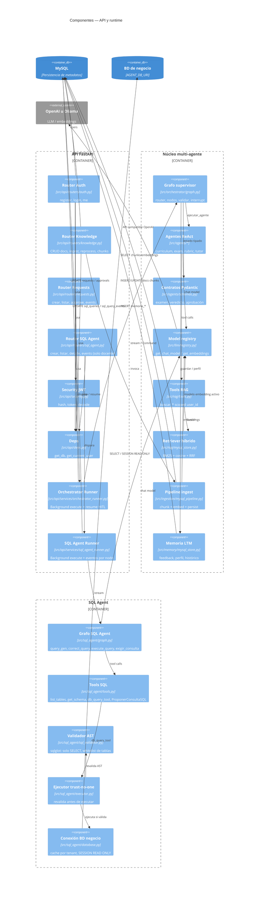

# C4 Nivel 3 — Componentes (API + orquestación)

Descomposición interna del contenedor API / runtime Python.

```mermaid
C4Component
title Componentes — API y runtime

Container_Boundary(api, "API FastAPI") {
    Component(auth_r, "Router Auth", "src/api/routers/auth.py", "register, login, me")
    Component(know_r, "Router Knowledge", "src/api/routers/knowledge.py", "CRUD docs, ingest, reprocess, chunks")
    Component(req_r, "Router Requests", "src/api/routers/requests.py", "crear, listar, approve, events")
    Component(sql_r, "Router SQL Agent", "src/api/routers/sql_agent.py", "crear, listar, detalle, events (solo docente)")
    Component(sec, "Security JWT", "src/api/security.py", "hash, token, decode")
    Component(deps, "Deps", "src/api/deps.py", "get_db, get_current_user")
    Component(runner, "Orchestrator Runner", "src/api/services/orchestrator_runner.py", "Background execute + resume HITL")
    Component(sqlrunner, "SQL Agent Runner", "src/api/services/sql_agent_runner.py", "Background execute + eventos por nodo")
}

Container_Boundary(core, "Núcleo multi-agente") {
    Component(graph, "Grafo supervisor", "src/orchestrator/graph.py", "router, nodos, validar, interrupt")
    Component(agents, "Agentes ReAct", "src/agents/*", "curriculum, exam, rubric, tutor")
    Component(schemas, "Contratos Pydantic", "src/agents/schemas.py", "examen, veredicto, aprobación")
    Component(registry, "Model registry", "src/llm/registry.py", "get_chat_model / get_embeddings")
    Component(tools, "Tools RAG", "src/rag/tools.py", "buscar_* scoped user_id")
    Component(retriever, "Retriever híbrido", "src/rag/mysql_store.py", "BM25 + cosine + RRF")
    Component(ingest, "Pipeline ingest", "src/ingestion/mysql_pipeline.py", "chunk + embed + persist")
    Component(mem, "Memoria LTM", "src/memory/mysql_store.py", "feedback, perfil, histórico")
}

Container_Boundary(sqlcore, "SQL Agent") {
    Component(sqlgraph, "Grafo SQL Agent", "src/sql_agent/graph.py", "query_gen, correct_query, execute_query, exigir_consulta")
    Component(sqltools, "Tools SQL", "src/sql_agent/tools.py", "list_tables, get_schema, db_query_tool, ProponerConsultaSQL")
    Component(validator, "Validador AST", "src/sql_agent/sql_validator.py", "sqlglot: solo SELECT, whitelist de tablas")
    Component(executor, "Ejecutor trust-no-one", "src/sql_agent/executor.py", "revalida antes de ejecutar")
    Component(bizdbconn, "Conexión BD negocio", "src/sql_agent/database.py", "cache por tenant, SESSION READ ONLY")
}

ContainerDb(mysql, "MySQL", "Persistencia de metadatos")
ContainerDb(bizdb, "BD de negocio", "AGENT_DB_URI")
System_Ext(llmprov, "OpenAI u Ollama", "LLM / embeddings")

Rel(auth_r, sec, "usa")
Rel(auth_r, deps, "usa")
Rel(know_r, deps, "usa")
Rel(know_r, ingest, "invoca")
Rel(req_r, deps, "usa")
Rel(req_r, runner, "dispara / resume")
Rel(sql_r, deps, "usa")
Rel(sql_r, sqlrunner, "dispara")
Rel(runner, graph, "stream / Command")
Rel(sqlrunner, sqlgraph, "stream")
Rel(graph, agents, "ejecutar_agente")
Rel(graph, schemas, "estado tipado")
Rel(agents, tools, "tool calls")
Rel(agents, registry, "chat model")
Rel(tools, retriever, "buscar")
Rel(retriever, mysql, "SELECT chunks/embeddings")
Rel(retriever, registry, "modelo embedding activo")
Rel(ingest, mysql, "INSERT/UPDATE docs chunks")
Rel(ingest, registry, "embeddings")
Rel(registry, llmprov, "API compatible OpenAI")
Rel(graph, mem, "guardar / perfil")
Rel(mem, mysql, "INSERT memoria_*")
Rel(runner, mysql, "UPDATE requests / approvals")
Rel(auth_r, mysql, "users")
Rel(know_r, mysql, "documents")
Rel(sqlgraph, sqltools, "tool calls")
Rel(sqlgraph, registry, "chat model")
Rel(sqltools, executor, "db_query_tool")
Rel(executor, validator, "revalida AST")
Rel(executor, bizdbconn, "ejecuta si válida")
Rel(bizdbconn, bizdb, "SELECT / SESSION READ ONLY")
Rel(sqlrunner, mysql, "UPDATE sql_queries / sql_query_events")
```

## Mapa componente → tablas MySQL

| Componente | Tablas principales |
|------------|-------------------|
| Auth | `users` |
| Knowledge / Ingest | `documents`, `chunks`, `chunk_embeddings` |
| Requests / Runner | `requests`, `request_events`, `approvals` |
| SQL Agent / Runner | `sql_queries`, `sql_query_events` (metadatos); tablas de negocio en `AGENT_DB_URI` |
| Memoria | `memory_feedback`, `memory_perfil_alumno`, `memory_historico` |

## ContextVar de aislamiento

Antes de ejecutar el grafo, el runner fija:

- `set_rag_user_id(user_id)` → tools RAG
- `set_memory_user_id(user_id)` → memoria LTM

Así el mismo código de agentes sirve a todos los usuarios sin mezclar KB.

El SQL Agent usa un mecanismo distinto y más estricto: en vez de un `ContextVar`
ambiental, `tenant` (= `user_id` del docente) viaja como **argumento explícito y
obligatorio** por todas las capas (`construir_grafo` → `build_sql_tools` →
`ejecutar_sql_validado`), para que un bug de wiring no pueda ejecutar SQL sin que
quede claro a qué usuario pertenece la conexión cacheada a la BD de negocio.
