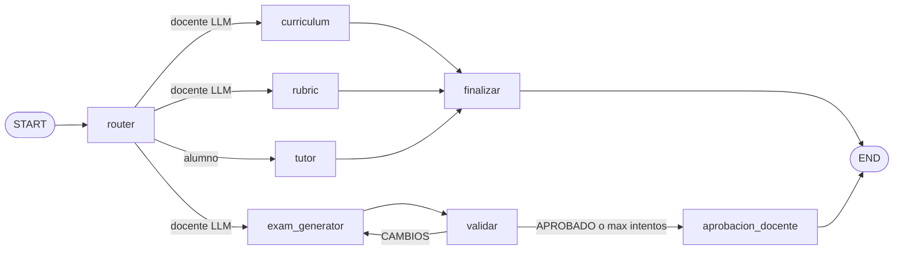
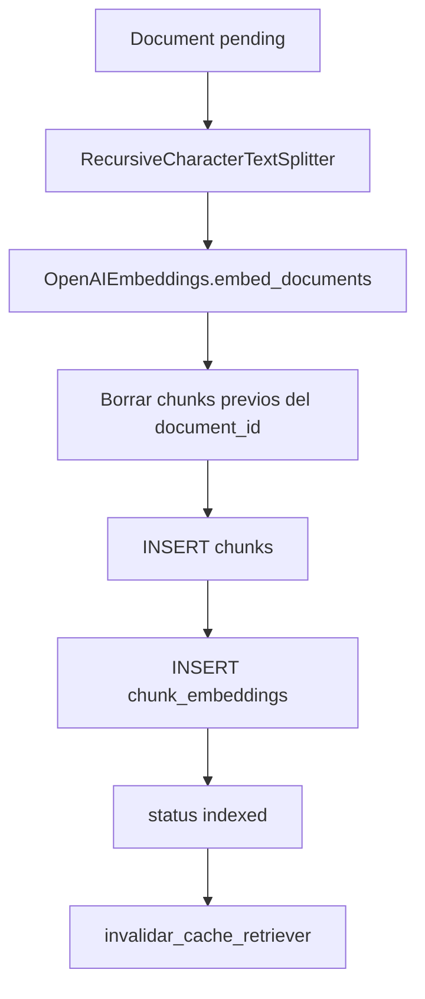
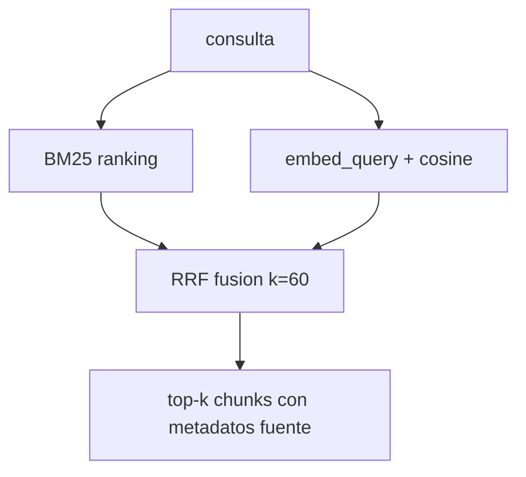
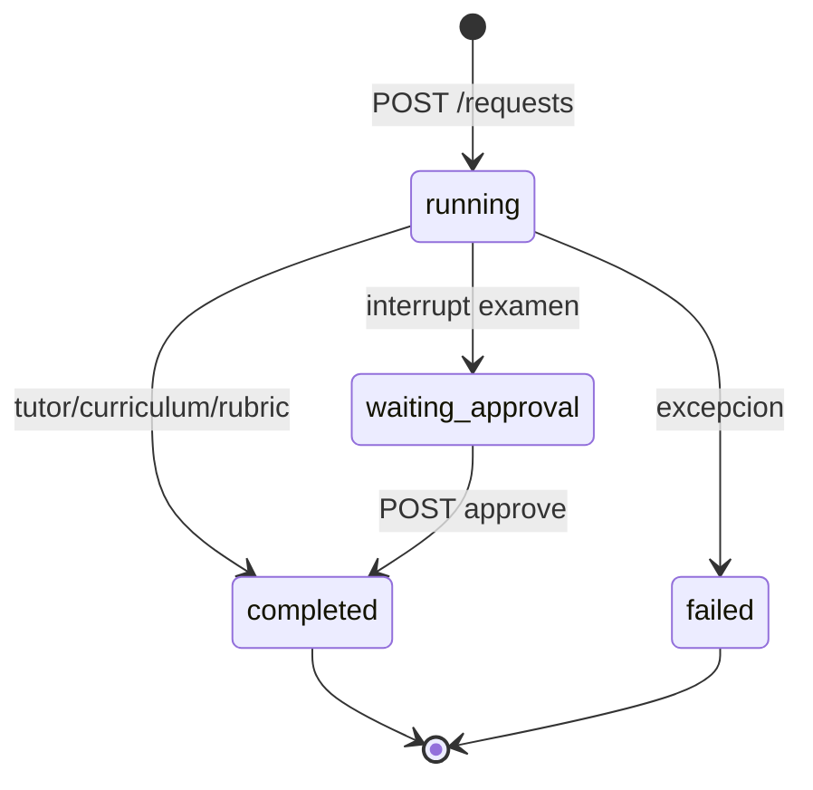

# C4 Nivel 4 — Vista de código (orquestador y RAG)

Detalle de módulos clave (no es un listado exhaustivo del repo).

## 4.1 Grafo supervisor

**Archivo:** `src/orchestrator/graph.py`  
**Factory:** `construir_grafo(checkpointer=..., memory_backend=...)`

## 4.2 Pipeline de ingest MySQL

**Archivo:** `src/ingestion/mysql_pipeline.py`

## 4.3 Retriever híbrido

**Archivo:** `src/rag/mysql_store.py`  
**Tools:** `src/rag/tools.py` (`buscar_apuntes`, `buscar_examenes_historicos`, `buscar_rubricas`, `buscar_curriculo`)

## 4.4 Paquetes Python relevantes

| Paquete | Rol |
|---------|-----|
| `src/api/` | Contenedor HTTP |
| `src/db/` | Modelos y sesión SQLAlchemy |
| `src/orchestrator/` | Grafo LangGraph |
| `src/agents/` | Prompts y factories ReAct |
| `src/rag/` | Contexto user_id + retriever + tools |
| `src/ingestion/` | Indexación a MySQL |
| `src/memory/` | LTM MySQL / JSON legacy |
| `src/observability/` | Trazas JSONL + LangSmith |
| `scripts/` | Ops y pipeline de pruebas |
| `tests/` | Pytest smoke API |

## 4.5 Contrato de una solicitud (estados)

