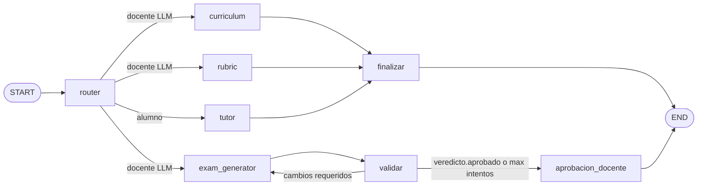
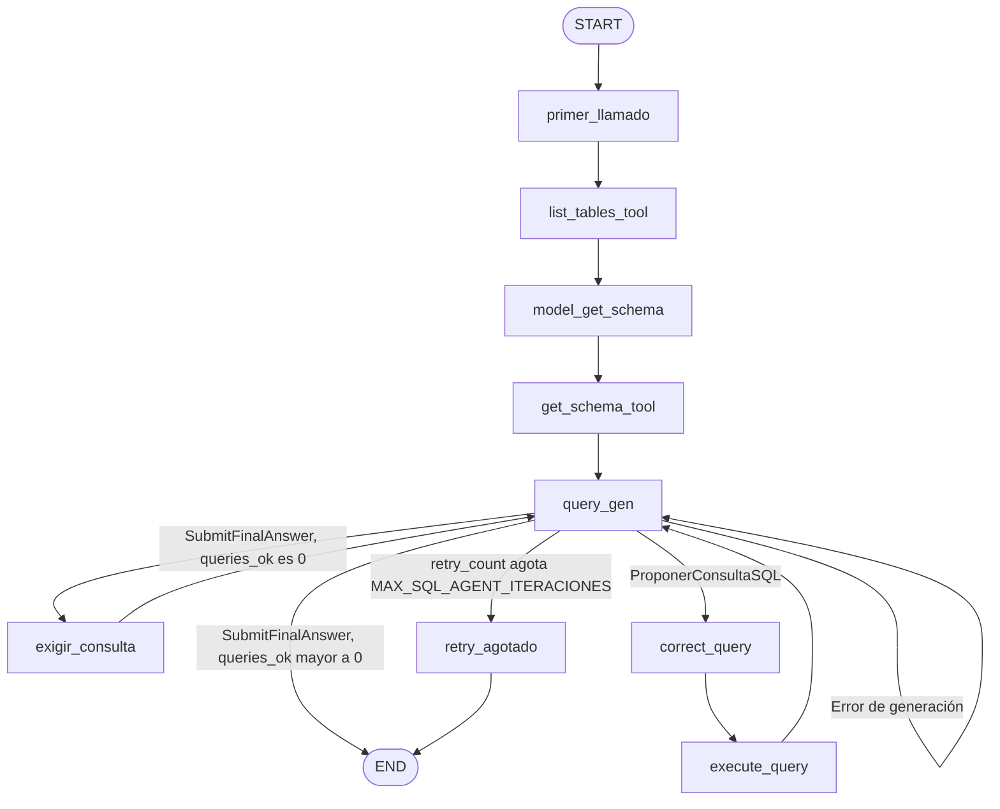
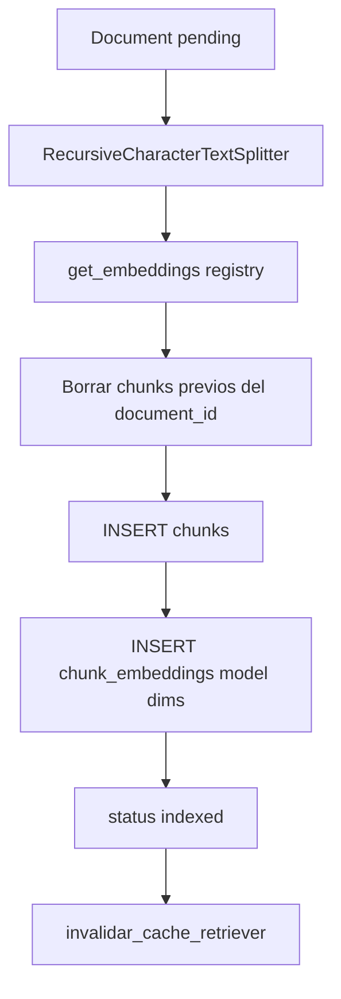
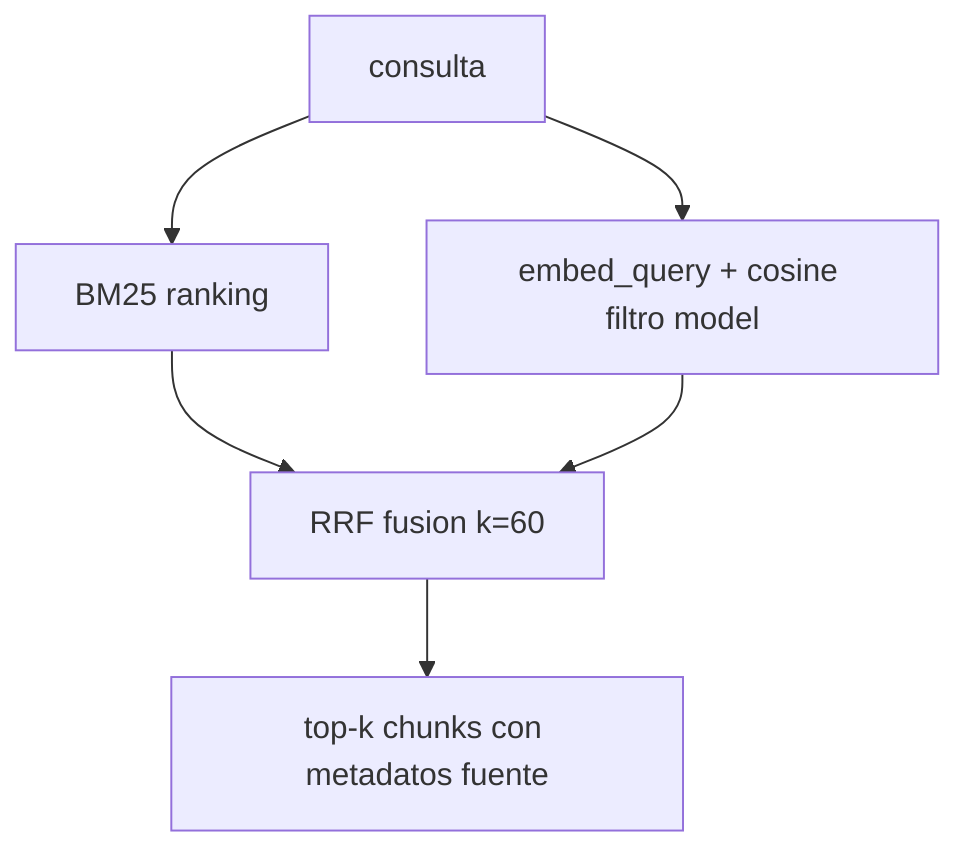
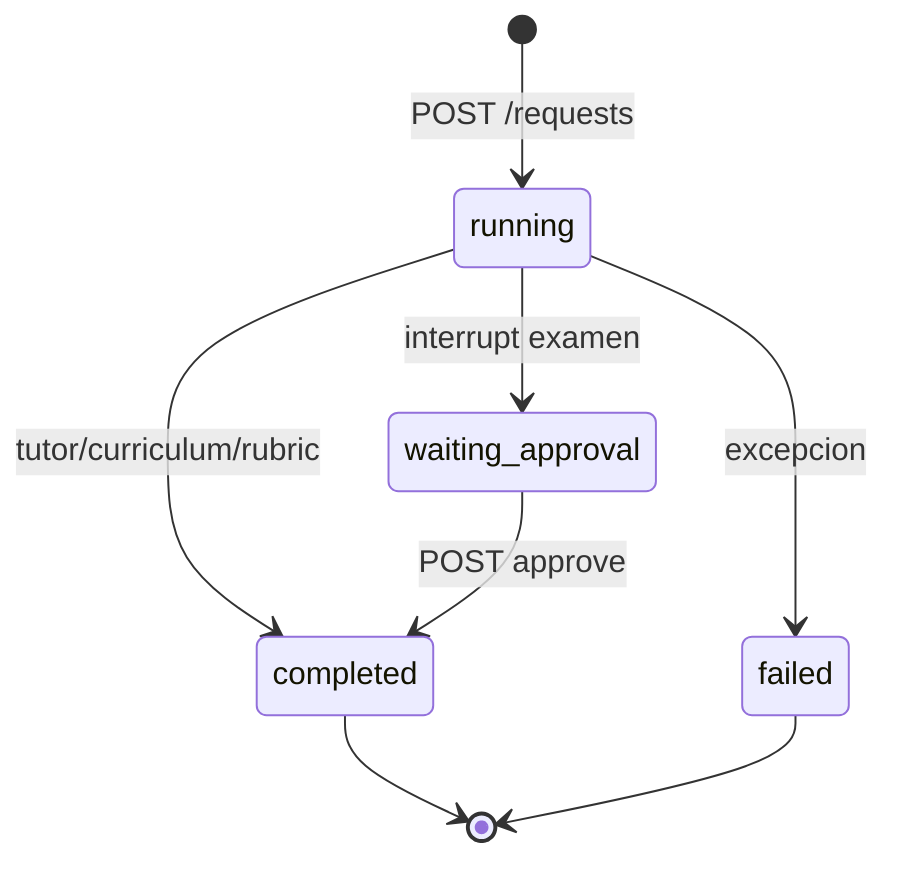
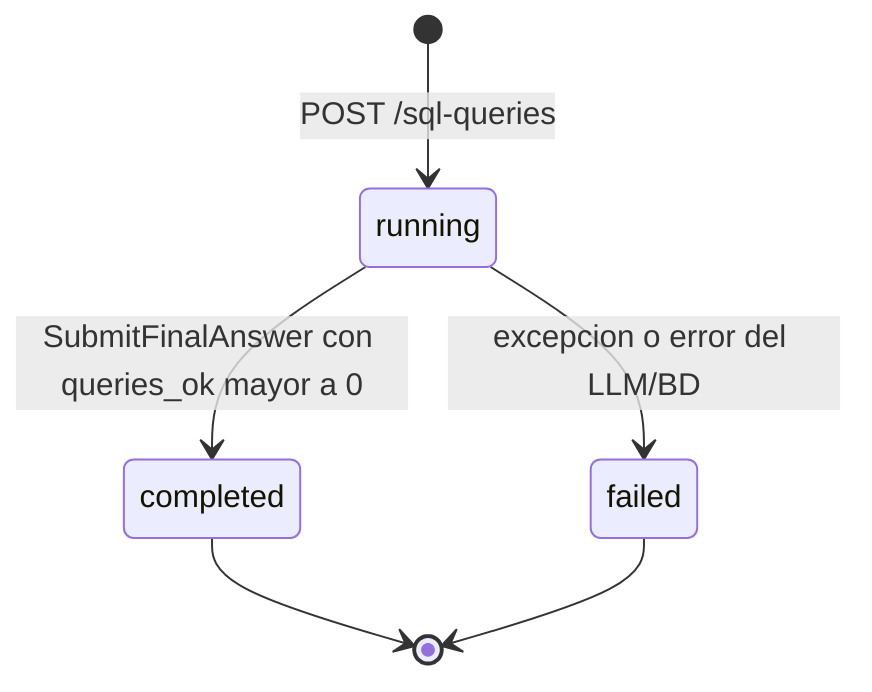

# C4 Nivel 4 — Vista de código (orquestador, SQL Agent y RAG)

Detalle de módulos clave (no es un listado exhaustivo del repo).

## 4.1 Grafo supervisor

```mermaid
flowchart LR
    START([START]) --> router
    router -->|alumno| tutor
    router -->|docente LLM| curriculum
    router -->|docente LLM| exam_generator
    router -->|docente LLM| rubric
    curriculum --> finalizar
    rubric --> finalizar
    tutor --> finalizar
    exam_generator --> validar
    validar -->|veredicto.aprobado o max intentos| aprobacion_docente
    validar -->|cambios requeridos| exam_generator
    finalizar --> END([END])
    aprobacion_docente --> END
```

**Archivo:** `src/orchestrator/graph.py`  
**Factory:** `construir_grafo(checkpointer=..., memory_backend=...)`

## 4.2 Grafo SQL Agent

```mermaid
flowchart TD
    START([START]) --> primer_llamado
    primer_llamado --> list_tables_tool
    list_tables_tool --> model_get_schema
    model_get_schema --> get_schema_tool
    get_schema_tool --> query_gen
    query_gen -->|SubmitFinalAnswer, queries_ok mayor a 0| END([END])
    query_gen -->|SubmitFinalAnswer, queries_ok es 0| exigir_consulta
    exigir_consulta --> query_gen
    query_gen -->|ProponerConsultaSQL| correct_query
    query_gen -->|Error de generación| query_gen
    query_gen -->|retry_count agota MAX_SQL_AGENT_ITERACIONES| retry_agotado
    correct_query --> execute_query
    execute_query --> query_gen
    retry_agotado --> END
```

**Archivo:** `src/sql_agent/graph.py`  
**Factory:** `construir_grafo(tenant=..., agent_db_uri=..., db=..., checkpointer=...)`  
**No es ReAct genérico**: `StateGraph` a medida con loop de autocorrección SQL y un
gate de grounding (`exigir_consulta`) que exige al menos una consulta exitosa
(`queries_ok` en el estado) antes de aceptar `SubmitFinalAnswer`.

## 4.3 Pipeline de ingest MySQL

```mermaid
flowchart TD
    Doc[Document pending] --> Split[RecursiveCharacterTextSplitter]
    Split --> Embed["get_embeddings registry"]
    Embed --> Del[Borrar chunks previos del document_id]
    Del --> InsC[INSERT chunks]
    InsC --> InsE["INSERT chunk_embeddings model dims"]
    InsE --> Idx[status indexed]
    Idx --> Cache[invalidar_cache_retriever]
```

**Archivo:** `src/ingestion/mysql_pipeline.py`  
**Embeddings:** `src/llm/registry.py` (`active_embedding_model`)

## 4.4 Retriever híbrido

```mermaid
flowchart TD
    Q[consulta] --> Lex[BM25 ranking]
    Q --> Sem["embed_query + cosine filtro model"]
    Lex --> RRF[RRF fusion k=60]
    Sem --> RRF
    RRF --> TopK[top-k chunks con metadatos fuente]
```

**Archivo:** `src/rag/mysql_store.py`  
**Tools:** `src/rag/tools.py` (`buscar_apuntes`, `buscar_examenes_historicos`, `buscar_rubricas`, `buscar_curriculo`)

## 4.5 Paquetes Python relevantes

| Paquete | Rol |
|---------|-----|
| `src/api/` | Contenedor HTTP JWT |
| `src/llm/` | Model registry (OpenAI / Ollama) |
| `src/db/` | Modelos y sesión SQLAlchemy |
| `src/orchestrator/` | Grafo LangGraph (supervisor multi-agente) |
| `src/agents/` | Prompts, ReAct y contratos Pydantic |
| `src/sql_agent/` | Grafo LangGraph NL→SQL, validador AST, ejecutor trust-no-one |
| `src/rag/` | Contexto user_id + retriever MySQL + tools |
| `src/ingestion/` | Indexación a MySQL |
| `src/memory/` | LTM MySQL / JSON legacy |
| `src/observability/` | Trazas JSONL + LangSmith |
| `app_streamlit/` | UI cliente HTTP |
| `scripts/` | Ops y pipeline de pruebas |
| `tests/` | Pytest (registry, contratos, SQL Agent, smoke API) |

## 4.6 Contrato de una solicitud (estados)

```mermaid
stateDiagram-v2
    [*] --> running: POST /requests
    running --> waiting_approval: interrupt examen
    running --> completed: tutor/curriculum/rubric
    running --> failed: excepcion
    waiting_approval --> completed: POST approve
    completed --> [*]
    failed --> [*]
```

## 4.7 Contrato de una consulta SQL (estados)

```mermaid
stateDiagram-v2
    [*] --> running: POST /sql-queries
    running --> completed: SubmitFinalAnswer con queries_ok mayor a 0
    running --> failed: excepcion o error del LLM/BD
    completed --> [*]
    failed --> [*]
```

Más simple que `requests`: sin `waiting_approval` (no hay HITL en el SQL Agent).
