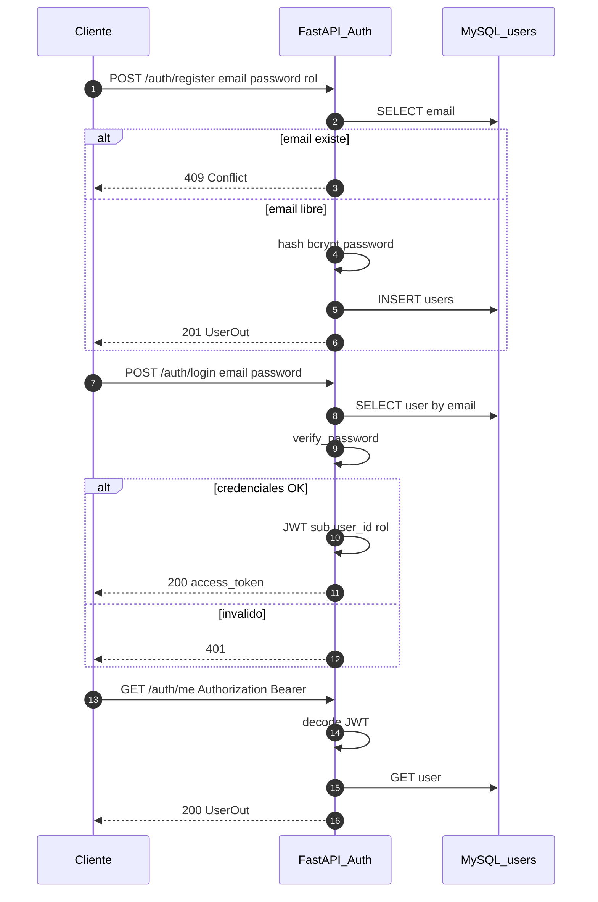
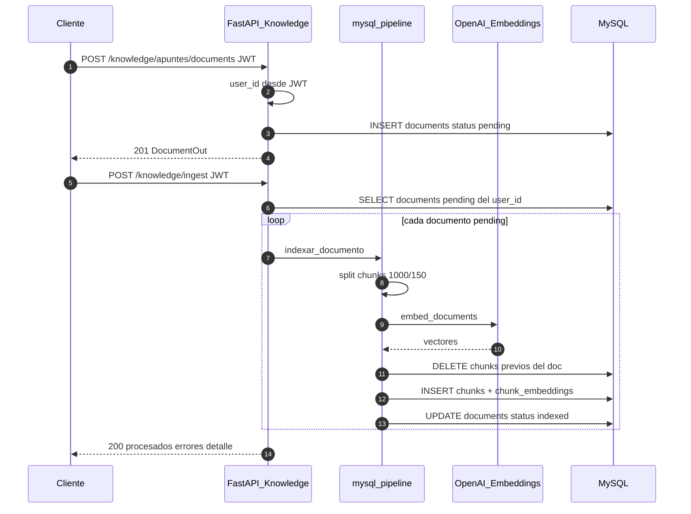
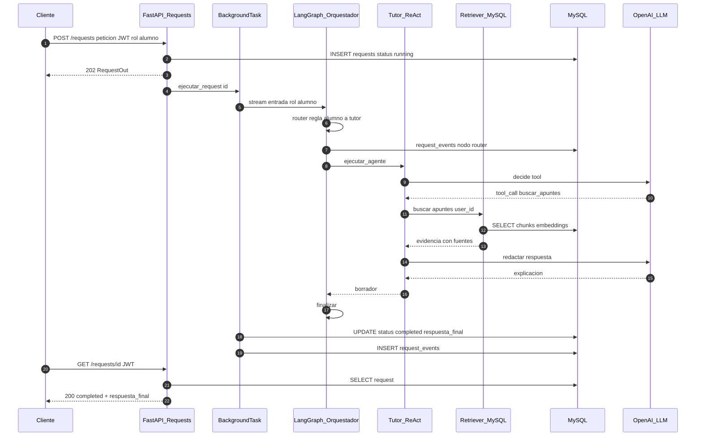
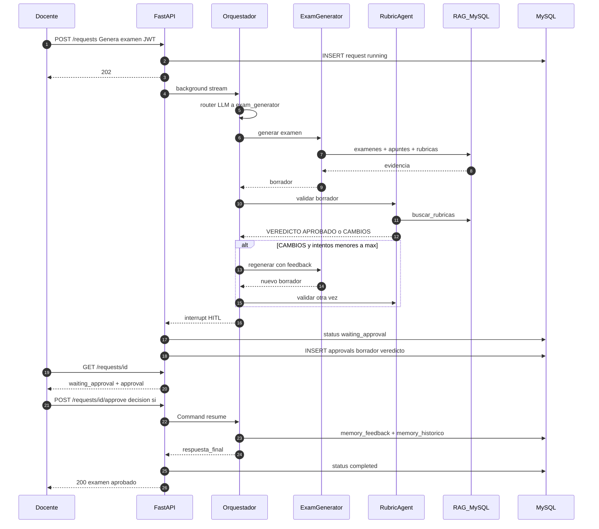
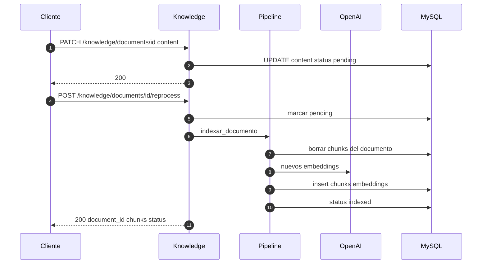
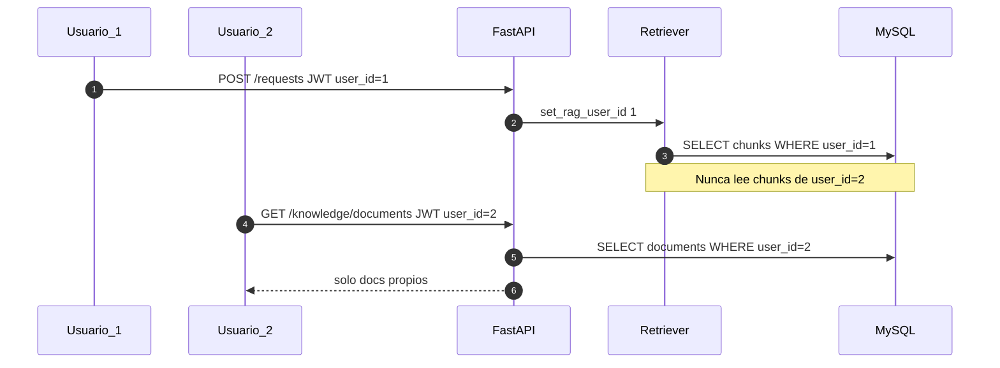

# Diagramas de secuencia

Flujos principales del backend (API REST + LangGraph + MySQL).  
Complementa [arquitectura.md](arquitectura.md) y el modelo C4 en [c4/](c4/).

## 1. Autenticación (registro y login)

## 2. Conocimiento: alta e ingest a demanda

## 3. Solicitud alumno / tutoría (sin HITL)

## 4. Solicitud docente: generar examen + HITL

## 5. Reprocess de un documento

## 6. Aislamiento multi-usuario (consulta RAG)

## Leyenda de estados de `requests`

| Status | Significado |
|--------|-------------|
| `running` | Grafo en ejecución |
| `waiting_approval` | Interrupt HITL; falta `POST .../approve` |
| `completed` | Respuesta final disponible |
| `failed` | Error registrado en `error` |
