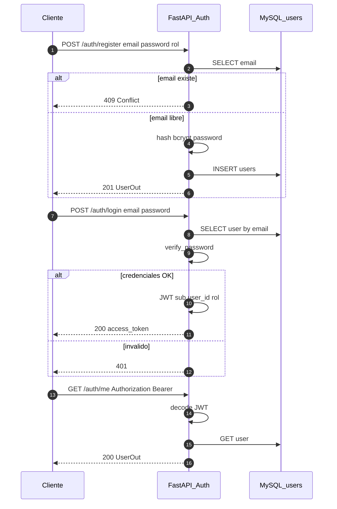
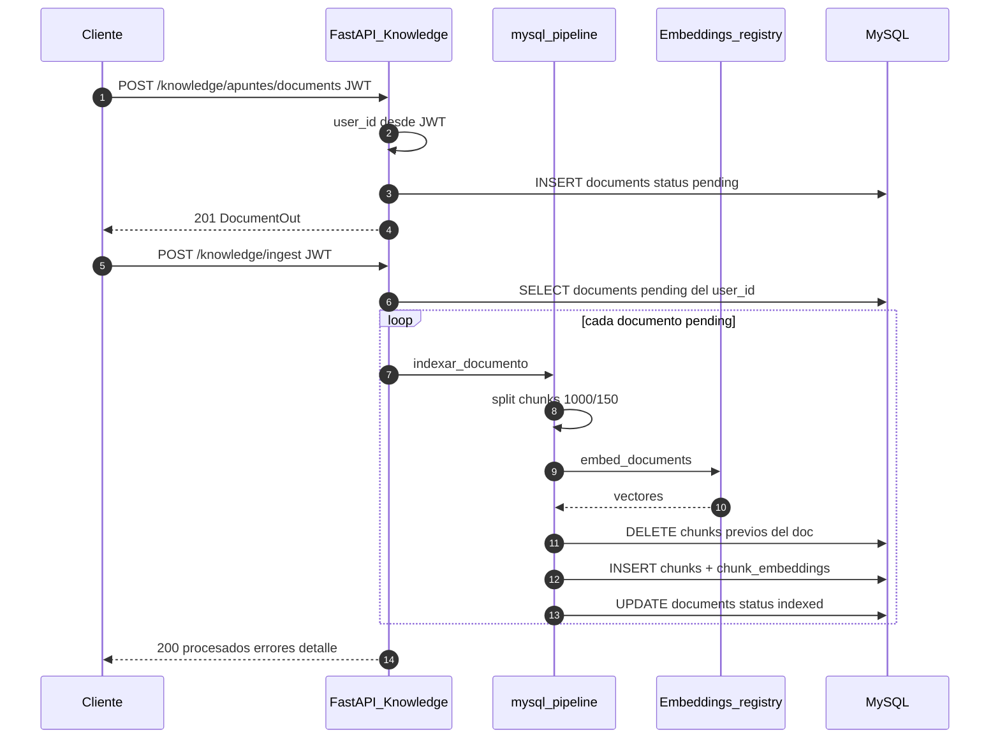
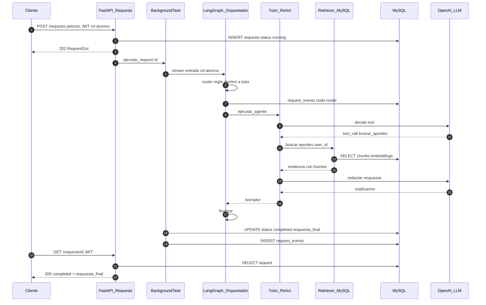
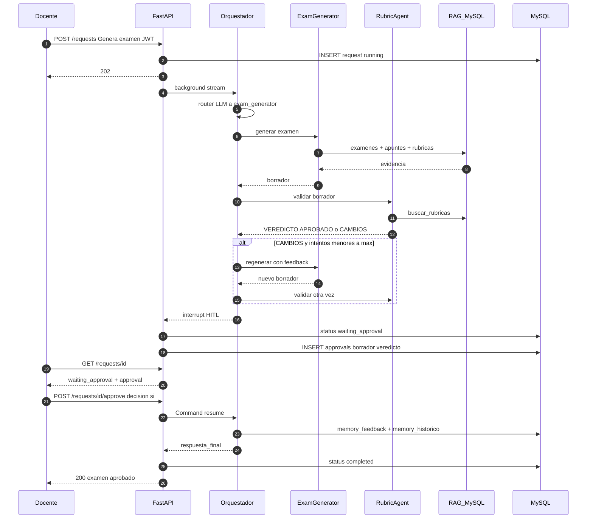
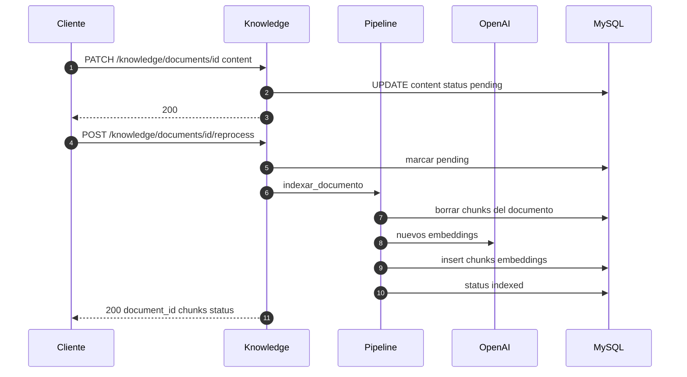
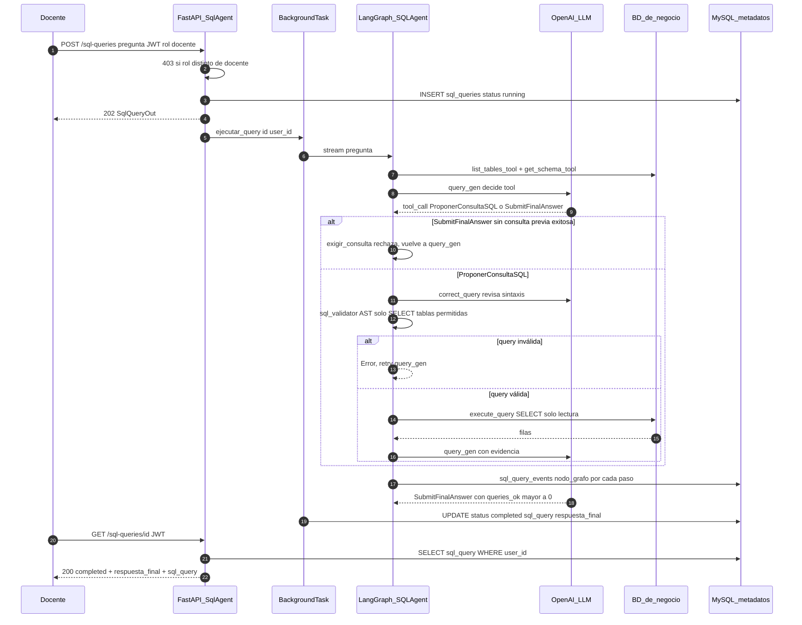
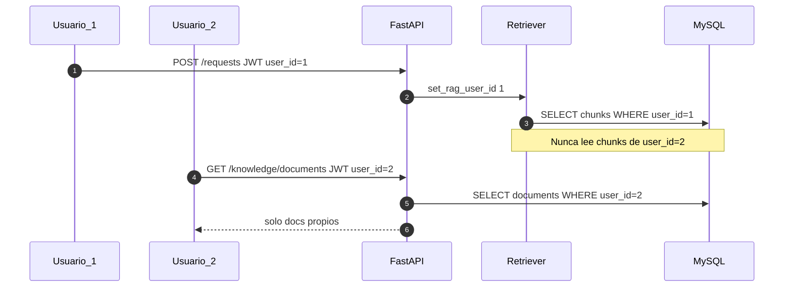

# Diagramas de secuencia

Flujos principales del backend (API REST + LangGraph + MySQL), incluidas las
consultas en lenguaje natural del SQL Agent contra la BD de negocio.  
El cliente de referencia es **Streamlit** (`app_streamlit/`), que solo dispara estas
llamadas HTTP; también aplican a Postman/scripts.

Complementa [arquitectura.md](arquitectura.md) y el modelo C4 en [c4/](c4/).

## 1. Autenticación (registro y login)

```mermaid
sequenceDiagram
    autonumber
    participant C as Cliente
    participant API as FastAPI_Auth
    participant DB as MySQL_users

    C->>API: POST /auth/register email password rol
    API->>DB: SELECT email
    alt email existe
        API-->>C: 409 Conflict
    else email libre
        API->>API: hash bcrypt password
        API->>DB: INSERT users
        API-->>C: 201 UserOut
    end

    C->>API: POST /auth/login email password
    API->>DB: SELECT user by email
    API->>API: verify_password
    alt credenciales OK
        API->>API: JWT sub user_id rol
        API-->>C: 200 access_token
    else invalido
        API-->>C: 401
    end

    C->>API: GET /auth/me Authorization Bearer
    API->>API: decode JWT
    API->>DB: GET user
    API-->>C: 200 UserOut
```

## 2. Conocimiento: alta e ingest a demanda

```mermaid
sequenceDiagram
    autonumber
    participant C as Cliente
    participant API as FastAPI_Knowledge
    participant Pipe as mysql_pipeline
    participant Emb as Embeddings_registry
    participant DB as MySQL

    C->>API: POST /knowledge/apuntes/documents JWT
    API->>API: user_id desde JWT
    API->>DB: INSERT documents status pending
    API-->>C: 201 DocumentOut

    C->>API: POST /knowledge/ingest JWT
    API->>DB: SELECT documents pending del user_id
    loop cada documento pending
        API->>Pipe: indexar_documento
        Pipe->>Pipe: split chunks 1000/150
        Pipe->>Emb: embed_documents
        Emb-->>Pipe: vectores
        Pipe->>DB: DELETE chunks previos del doc
        Pipe->>DB: INSERT chunks + chunk_embeddings
        Pipe->>DB: UPDATE documents status indexed
    end
    API-->>C: 200 procesados errores detalle
```

## 3. Solicitud alumno / tutoría (sin HITL)

```mermaid
sequenceDiagram
    autonumber
    participant C as Cliente
    participant API as FastAPI_Requests
    participant BG as BackgroundTask
    participant Orq as LangGraph_Orquestador
    participant Tutor as Tutor_ReAct
    participant RAG as Retriever_MySQL
    participant DB as MySQL
    participant LLM as OpenAI_LLM

    C->>API: POST /requests peticion JWT rol alumno
    API->>DB: INSERT requests status running
    API-->>C: 202 RequestOut
    API->>BG: ejecutar_request id

    BG->>Orq: stream entrada rol alumno
    Orq->>Orq: router regla alumno a tutor
    Orq->>DB: request_events nodo router
    Orq->>Tutor: ejecutar_agente
    Tutor->>LLM: decide tool
    LLM-->>Tutor: tool_call buscar_apuntes
    Tutor->>RAG: buscar apuntes user_id
    RAG->>DB: SELECT chunks embeddings
    RAG-->>Tutor: evidencia con fuentes
    Tutor->>LLM: redactar respuesta
    LLM-->>Tutor: explicacion
    Tutor-->>Orq: borrador
    Orq->>Orq: finalizar
    BG->>DB: UPDATE status completed respuesta_final
    BG->>DB: INSERT request_events

    C->>API: GET /requests/id JWT
    API->>DB: SELECT request
    API-->>C: 200 completed + respuesta_final
```

## 4. Solicitud docente: generar examen + HITL

```mermaid
sequenceDiagram
    autonumber
    participant D as Docente
    participant API as FastAPI
    participant Orq as Orquestador
    participant EG as ExamGenerator
    participant RA as RubricAgent
    participant RAG as RAG_MySQL
    participant DB as MySQL

    D->>API: POST /requests Genera examen JWT
    API->>DB: INSERT request running
    API-->>D: 202
    API->>Orq: background stream

    Orq->>Orq: router LLM a exam_generator
    Orq->>EG: generar examen
    EG->>RAG: examenes + apuntes + rubricas
    RAG-->>EG: evidencia
    EG-->>Orq: borrador

    Orq->>RA: validar borrador
    RA->>RAG: buscar_rubricas
    RA-->>Orq: VEREDICTO APROBADO o CAMBIOS

    alt CAMBIOS y intentos menores a max
        Orq->>EG: regenerar con feedback
        EG-->>Orq: nuevo borrador
        Orq->>RA: validar otra vez
    end

    Orq-->>API: interrupt HITL
    API->>DB: status waiting_approval
    API->>DB: INSERT approvals borrador veredicto

    D->>API: GET /requests/id
    API-->>D: waiting_approval + approval

    D->>API: POST /requests/id/approve decision si
    API->>Orq: Command resume
    Orq->>DB: memory_feedback + memory_historico
    Orq-->>API: respuesta_final
    API->>DB: status completed
    API-->>D: 200 examen aprobado
```

## 5. Reprocess de un documento

```mermaid
sequenceDiagram
    autonumber
    participant C as Cliente
    participant API as Knowledge
    participant Pipe as Pipeline
    participant Emb as OpenAI
    participant DB as MySQL

    C->>API: PATCH /knowledge/documents/id content
    API->>DB: UPDATE content status pending
    API-->>C: 200

    C->>API: POST /knowledge/documents/id/reprocess
    API->>DB: marcar pending
    API->>Pipe: indexar_documento
    Pipe->>DB: borrar chunks del documento
    Pipe->>Emb: nuevos embeddings
    Pipe->>DB: insert chunks embeddings
    Pipe->>DB: status indexed
    API-->>C: 200 document_id chunks status
```

## 6. Consulta SQL en lenguaje natural (SQL Agent)

```mermaid
sequenceDiagram
    autonumber
    participant D as Docente
    participant API as FastAPI_SqlAgent
    participant BG as BackgroundTask
    participant SQL as LangGraph_SQLAgent
    participant LLM as OpenAI_LLM
    participant BizDB as BD_de_negocio
    participant DB as MySQL_metadatos

    D->>API: POST /sql-queries pregunta JWT rol docente
    API->>API: 403 si rol distinto de docente
    API->>DB: INSERT sql_queries status running
    API-->>D: 202 SqlQueryOut
    API->>BG: ejecutar_query id user_id

    BG->>SQL: stream pregunta
    SQL->>BizDB: list_tables_tool + get_schema_tool
    SQL->>LLM: query_gen decide tool
    LLM-->>SQL: tool_call ProponerConsultaSQL o SubmitFinalAnswer

    alt SubmitFinalAnswer sin consulta previa exitosa
        SQL->>SQL: exigir_consulta rechaza, vuelve a query_gen
    else ProponerConsultaSQL
        SQL->>LLM: correct_query revisa sintaxis
        SQL->>SQL: sql_validator AST solo SELECT tablas permitidas
        alt query inválida
            SQL-->>SQL: Error, retry query_gen
        else query válida
            SQL->>BizDB: execute_query SELECT solo lectura
            BizDB-->>SQL: filas
            SQL->>LLM: query_gen con evidencia
        end
    end

    SQL->>DB: sql_query_events nodo_grafo por cada paso
    LLM-->>SQL: SubmitFinalAnswer con queries_ok mayor a 0
    BG->>DB: UPDATE status completed sql_query respuesta_final

    D->>API: GET /sql-queries/id JWT
    API->>DB: SELECT sql_query WHERE user_id
    API-->>D: 200 completed + respuesta_final + sql_query
```

## 7. Aislamiento multi-usuario (consulta RAG)

```mermaid
sequenceDiagram
    autonumber
    participant U1 as Usuario_1
    participant U2 as Usuario_2
    participant API as FastAPI
    participant RAG as Retriever
    participant DB as MySQL

    U1->>API: POST /requests JWT user_id=1
    API->>RAG: set_rag_user_id 1
    RAG->>DB: SELECT chunks WHERE user_id=1
    Note over RAG,DB: Nunca lee chunks de user_id=2

    U2->>API: GET /knowledge/documents JWT user_id=2
    API->>DB: SELECT documents WHERE user_id=2
    API-->>U2: solo docs propios
```

## Leyenda de estados de `requests`

| Status | Significado |
|--------|-------------|
| `running` | Grafo en ejecución |
| `waiting_approval` | Interrupt HITL; falta `POST .../approve` |
| `completed` | Respuesta final disponible |
| `failed` | Error registrado en `error` |

## Leyenda de estados de `sql_queries`

Sin `waiting_approval`: el SQL Agent no tiene HITL, solo el gate de grounding interno
(`exigir_consulta`) antes de llegar a `completed`.

| Status | Significado |
|--------|-------------|
| `running` | Grafo del SQL Agent en ejecución |
| `completed` | `respuesta_final` y (si hubo evidencia) `sql_query` disponibles |
| `failed` | Error registrado en `error` (p. ej. `AGENT_DB_URI` inválido, error del LLM) |
