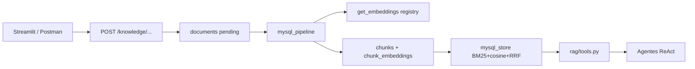
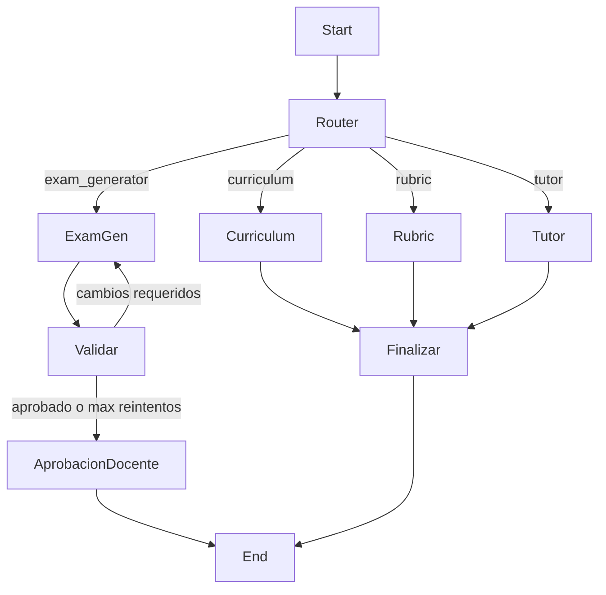

# Implementación — Asistente IA para Educación

Documento técnico de lo construido: código, API JWT, UI Streamlit, Docker y despliegue.
La arquitectura conceptual está en [arquitectura.md](arquitectura.md).

## 1. Qué se implementó

| Capa | Tecnología | Ubicación |
|---|---|---|
| API JWT | FastAPI + Uvicorn | `src/api/` (`src.api.main:app`) |
| UI | Streamlit (cliente HTTP) | `app_streamlit/` |
| Orquestación multi-agente | LangGraph (supervisor + ReAct) | `src/orchestrator/`, `src/agents/` |
| Contratos entre agentes | Pydantic | `src/agents/schemas.py` |
| Conocimiento (RAG) | MySQL: BM25 + embeddings + RRF | `src/ingestion/mysql_pipeline.py`, `src/rag/mysql_store.py` |
| Model registry | OpenAI / Ollama vía perfiles | `src/llm/registry.py` |
| Memoria | Checkpointer (sesión) + MySQL (LTM) | LangGraph + `src/memory/` |
| Auth | JWT + bcrypt | `src/api/security.py` |
| CLI legado | `main.py` (+ Chroma opcional) | `main.py`, `src/legacy_chat_api.py` |
| Contenedor | Docker | `Dockerfile`, `docker-compose.yml` |

## 2. Estructura del repositorio

```
Orquestacion-Agentes/
├── app_streamlit/             # UI Streamlit (cliente de la API JWT)
│   ├── Home.py
│   ├── pages/                 # Conocimiento, Asistente, Historial, Aprobaciones
│   └── lib/                   # api_client, session, ui
├── data/                      # Material de ejemplo / seed (CLI legado)
├── docs/
│   ├── arquitectura.md
│   ├── implementacion.md      # Este documento
│   ├── diagramas-secuencia.md
│   └── c4/
├── postman/
├── scripts/                   # init_db, seed_demo_kb, run_test_pipeline, remote.sh
├── src/
│   ├── api/                   # API JWT (auth, knowledge, requests, HITL)
│   ├── agents/                # Curriculum, Exam, Rubric, Tutor + schemas
│   ├── llm/                   # Model registry
│   ├── ingestion/             # mysql_pipeline (+ pipeline Chroma legado)
│   ├── rag/                   # mysql_store, tools, chroma_client (legado)
│   ├── memory/
│   ├── orchestrator/graph.py
│   ├── legacy_chat_api.py     # API chat legado /api/v1/*
│   └── config.py
├── tests/
├── Dockerfile
├── docker-compose.yml
├── main.py
├── requirements.txt
└── .env.example
```

Persistencia **API JWT** (fuente de verdad):

| Almacén | Contenido |
|---|---|
| MySQL | users, documents, chunks, chunk_embeddings, requests, approvals, memoria_* |
| `storage/logs/` | Trazas JSONL locales (opcional) |

Chroma / `storage/chunks` solo aplican al **CLI / API legado**, no al happy path JWT.

## 3. Flujo de conocimiento (API)

Los agentes en el flujo API **no leen `data/` en caliente**. El conocimiento usable es el de la KB del usuario en MySQL:



### 3.1 Cómo añadir documentación (vía API / Streamlit)

1. Login JWT (`POST /auth/login` o pantalla Home de Streamlit).
2. Crear documento: `POST /knowledge/{indice}/documents` con `filename` + `content_text`  
   (`indice` ∈ `apuntes` | `examenes` | `rubricas` | `curriculo`).
3. Ingestar pendientes: `POST /knowledge/ingest` (o botón en **Conocimiento**).
4. Opcional: `POST /knowledge/documents/{id}/reprocess` tras editar.

Seed demo: `python scripts/seed_demo_kb.py` (usuario `demo@instituto.local` / `demo1234`).

### 3.2 Búsqueda híbrida (MySQL)

Cada tool RAG (`buscar_apuntes`, …):

1. BM25 sobre chunks del `user_id` + índice.
2. Embedding de consulta + coseno solo contra filas con `chunk_embeddings.model` = modelo activo.
3. Fusión RRF (`k=60`).
4. Devuelve trozos con metadatos de fuente.

Si cambias de modelo de embedding (`LLM_PROFILE` / overrides), **reprocesa** la KB para vectores del nuevo modelo (BM25 sigue disponible).

## 4. Orquestación y agentes

Grafo en `src/orchestrator/graph.py`:



Comportamiento relevante:

- **Alumno** → siempre Tutor (salvaguarda, sin LLM en el router).
- **Examen** → Exam Generator → Rubric (`veredicto.aprobado` tipado) → `interrupt` HITL.
- Contratos: `ExamenGenerado`, `VeredictoValidacion`, `PayloadAprobacion` en `src/agents/schemas.py`.
- **Límite ReAct**: `MAX_ITERACIONES_REACT` en `src/config.py`.
- Chat/embeddings: `src/llm/registry.py` (`get_chat_model`, `get_embeddings`).

## 5. API JWT (`src.api.main:app`)

```bash
uvicorn src.api.main:app --reload --port 8000
```

Swagger: `http://127.0.0.1:8000/docs` · Health: `GET /health` (incluye `llm` del registry).

### 5.1 Endpoints

| Método | Ruta | Auth | Descripción |
|---|---|---|---|
| `GET` | `/health` | No | Liveness + selección LLM |
| `POST` | `/auth/register` | No | Alta usuario (`docente` \| `alumno`) |
| `POST` | `/auth/login` | No | JWT Bearer |
| `GET` | `/auth/me` | Sí | Usuario actual |
| `POST` | `/knowledge/{indice}/documents` | Sí | Crear doc `pending` |
| `GET` | `/knowledge/documents` | Sí | Listar |
| `GET/PATCH/DELETE` | `/knowledge/documents/{id}` | Sí | Detalle / editar / borrar |
| `POST` | `/knowledge/ingest` | Sí | Indexar pendientes |
| `POST` | `/knowledge/documents/{id}/reprocess` | Sí | Reprocesar uno |
| `GET` | `/knowledge/chunks` | Sí | Chunks (máx. 200) |
| `POST` | `/requests` | Sí | Arranca job async (202) |
| `GET` | `/requests` | Sí | Listar propias |
| `GET` | `/requests/{id}` | Sí | Detalle + approval |
| `POST` | `/requests/{id}/approve` | Sí + docente | HITL `si`/`no` |
| `GET` | `/requests/{id}/events` | Sí | Event log |

Aislamiento: todo filtrado por `user_id` del JWT.

### 5.2 Solicitudes y HITL

1. `POST /requests` `{ "peticion": "..." }` → `status: running`.
2. Polling `GET /requests/{id}` hasta `completed` | `failed` | `waiting_approval`.
3. Si examen: `POST /requests/{id}/approve` `{ "decision": "si" }` y volver a poll.

### 5.3 API legado

`src.legacy_chat_api:app` — rutas `/api/v1/health`, `/chat`, `/approve`, `/ingestar`.  
Docker Compose aún puede apuntar aquí; el camino recomendado en desarrollo es `src.api.main:app`.

## 6. UI Streamlit

Cliente HTTP puro (no importa LangGraph ni RAG):

```bash
# Terminal 1
uvicorn src.api.main:app --reload --port 8000

# Terminal 2
streamlit run app_streamlit/Home.py
```

| Página | Función |
|---|---|
| Home | Login / registro + sidebar (rol, modelo activo) |
| Conocimiento | CRUD docs, ingest, chunks |
| Asistente | `POST /requests` + polling |
| Historial | Lista + eventos |
| Aprobaciones | HITL (solo docente) |

`STREAMLIT_API_BASE_URL` (default `http://127.0.0.1:8000`).

## 7. Variables de entorno

Ver `.env.example`. Claves:

| Variable | Uso |
|---|---|
| `DATABASE_URL` | MySQL (SQLAlchemy) |
| `JWT_SECRET`, `JWT_EXPIRE_MINUTES` | Auth |
| `CORS_ORIGINS` | CORS API |
| `LLM_PROFILE` | `cloud_openai` \| `local_barato` \| `local_calidad` |
| `LLM_*` / `EMBEDDING_*` / `OLLAMA_BASE_URL` | Overrides del perfil |
| `OPENAI_API_KEY` | Perfil cloud / provider openai |
| `STREAMLIT_API_BASE_URL` | Base URL del cliente Streamlit |
| `LANGCHAIN_*` | LangSmith opcional |
| `SSH_*`, `DEPLOY_*`, `API_BASE_URL`, `DOCKER_IMAGE` | Despliegue VPS |

Bootstrap:

```bash
python scripts/init_db.py
python scripts/seed_demo_kb.py
```

## 8. Docker y VPS

### 8.1 Imagen / Compose

- Base: `python:3.13-slim`, puerto `8000`
- CMD actual del Dockerfile: suele ser la API legado (`src.legacy_chat_api:app`)
- Para JWT en local preferir Uvicorn directo (sección 5)

```bash
docker compose up -d --build
# Health legado: GET /api/v1/health
# Health JWT:    GET /health  (si el CMD apunta a src.api.main:app)
```

### 8.2 Despliegue remoto

Helper: `./scripts/remote.sh deploy|build|push-image|rsync|restart|health`.

El VPS tiene poca RAM: build local → `docker save | ssh docker load`. Detalle de host/rutas en `.env` (`SSH_HOST`, `DEPLOY_PATH`, …).

## 9. Pruebas

```bash
# Unitarios / contratos / registry
pytest tests/test_llm_registry.py tests/test_schemas_contratos.py -v

# Smoke API (requiere MySQL + .env)
python scripts/run_test_pipeline.py
```

Postman: [`postman/Asistente-IA-Educacion.postman_collection.json`](../postman/Asistente-IA-Educacion.postman_collection.json)  
(puede incluir rutas legado `/api/v1/*`; para JWT usar Swagger `/docs` o Streamlit).

## 10. CLI local (legado)

```bash
python main.py ingestar
python main.py demo
python main.py docente "Estructura la unidad de electricidad"
python main.py alumno "¿Qué es la ley de Ohm?" alumno-042
```

Usa índices Chroma/`data/`; no sustituye la KB MySQL por usuario de la API JWT.

## 11. Limitaciones conocidas del MVP

- PDFs vía API: hoy el alta es texto (`content_text`); OCR no incluido.
- Examen aprobado se guarda en memoria LTM; reindexación automática en `examenes` pendiente.
- Checkpointer `MemorySaver` in-process: se pierde al reiniciar el proceso API.
- Un worker Uvicorn; cargas concurrentes pesadas no recomendadas en VPS pequeño.
- Docker Compose puede seguir sirviendo la API legado hasta alinear el CMD con `src.api.main:app`.

## 12. Relación con la documentación de arquitectura

| Directriz ([arquitectura.md](arquitectura.md)) | Dónde está en código |
|---|---|
| Supervisor + ReAct | `src/orchestrator/graph.py`, `src/agents/base.py` |
| Contratos Pydantic | `src/agents/schemas.py` |
| RAG MySQL multi-índice | `src/ingestion/mysql_pipeline.py`, `src/rag/mysql_store.py` |
| Model registry | `src/llm/registry.py` |
| Human-in-the-loop | nodo `aprobacion_docente` + `POST /requests/{id}/approve` |
| Cliente UI | `app_streamlit/` |
| Memoria corto/largo plazo | checkpointer LangGraph + `src/memory/` |
