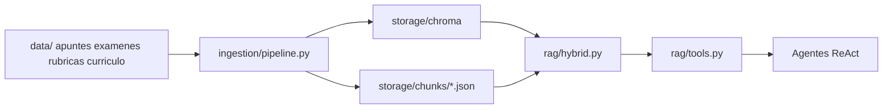
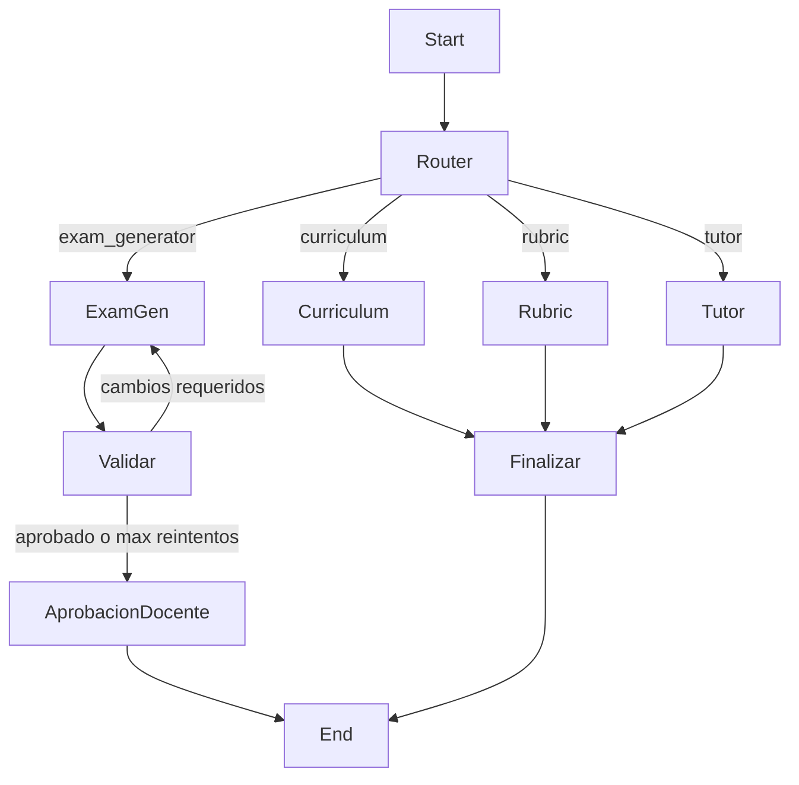

# Implementación — Asistente IA para Educación

Documento técnico de lo construido: código, API HTTP, Docker y despliegue.
La arquitectura conceptual y las directrices (orquestación, conocimiento, aprendizaje)
están en [arquitectura.md](arquitectura.md).

## 1. Qué se implementó

| Capa | Tecnología | Ubicación |
|---|---|---|
| Orquestación multi-agente | LangGraph (supervisor + ReAct) | `src/orchestrator/`, `src/agents/` |
| Conocimiento (RAG) | ChromaDB + BM25 + RRF | `src/ingestion/`, `src/rag/` |
| Memoria | Checkpointer (sesión) + JSON (largo plazo) | `src/memory/`, LangGraph |
| API HTTP | FastAPI + Uvicorn | `src/api.py` |
| Contenedor | Docker (`python:3.13-slim`) | `Dockerfile`, `docker-compose.yml` |
| CLI local | Typer implícito vía `main.py` | `main.py` |

Stack LLM: OpenAI vía `langchain-openai` (`ChatOpenAI` + `OpenAIEmbeddings`). Configurable por `.env`.

## 2. Estructura del repositorio

```
Orquestacion-Agentes/
├── data/                      # Fuente documental del instituto (4 índices)
│   ├── apuntes/
│   ├── examenes/
│   ├── rubricas/
│   └── curriculo/
├── docs/
│   ├── arquitectura.md        # Directrices y diseño
│   └── implementacion.md      # Este documento
├── postman/
│   └── Asistente-IA-Educacion.postman_collection.json
├── src/
│   ├── api.py                 # API FastAPI
│   ├── config.py              # Rutas, modelos, índices
│   ├── agents/                # Curriculum, Exam, Rubric, Tutor + schemas
│   ├── ingestion/pipeline.py  # Carga → chunk → Chroma + JSON
│   ├── rag/
│   │   ├── hybrid.py          # Retriever BM25 + embeddings + RRF
│   │   └── tools.py           # Tools RAG para los agentes
│   ├── memory/store.py        # feedback, perfiles, histórico
│   └── orchestrator/graph.py  # Grafo supervisor LangGraph
├── Dockerfile
├── docker-compose.yml
├── main.py                    # CLI: ingestar | docente | alumno | demo
├── requirements.txt
└── .env.example
```

En runtime (local o volumen Docker) aparece:

```
storage/
├── chroma/      # Embeddings (búsqueda semántica)
├── chunks/      # JSON por índice (BM25)
└── memoria/     # feedback_docente, perfil_alumno, historico_generaciones
```

## 3. Flujo de conocimiento

Los agentes **no leen `data/` en caliente**. El conocimiento usable se crea con la ingesta:



### 3.1 Cómo añadir documentación (PDF u otro)

1. Coloca el archivo en la carpeta correcta según su tipo:

| Tipo de documento | Carpeta |
|---|---|
| Apuntes, libro, tema | `data/apuntes/` |
| Exámenes antiguos | `data/examenes/` |
| Rúbricas / criterios | `data/rubricas/` |
| Currículo / programación | `data/curriculo/` |

2. Formatos aceptados: `.txt`, `.md`, `.pdf` (texto extraíble con `pypdf`; sin OCR).
3. Opcional en `.txt`/`.md`: cabecera de metadatos:

```text
---
asignatura: Tecnología
curso: 3º ESO
anio: 2024
tipo: apuntes
titulo: Electricidad
---
```

En PDF, hoy solo se guarda el nombre de archivo como `fuente`.

4. Ejecuta la ingesta:
   - Local: `python main.py ingestar`
   - API: `POST /api/v1/ingestar`

### 3.2 Búsqueda híbrida

Cada tool RAG (`buscar_apuntes`, `buscar_examenes_historicos`, `buscar_rubricas`, `buscar_curriculo`):

1. Ranking léxico (BM25 sobre tokens).
2. Ranking semántico (Chroma + embeddings OpenAI).
3. Fusión con Reciprocal Rank Fusion (`k=60`).
4. Devuelve trozos con cabecera `[fuente: ... | asignatura curso año]`.

## 4. Orquestación y agentes

Grafo en `src/orchestrator/graph.py`:



Comportamiento relevante:

- **Alumno** → siempre enruta a Tutor (salvaguarda).
- **Examen** → Exam Generator → Rubric Agent (validación cruzada, máx. 2 regeneraciones) → `interrupt` para aprobación humana.
- **Límite ReAct**: `MAX_ITERACIONES_REACT = 10` en `src/config.py`.
- Tras aprobar un examen se escribe en `feedback_docente` e `historico_generaciones` (aún no se reindexa automáticamente en el RAG).

## 5. API HTTP

Servicio: `src.api:app` (Uvicorn en puerto **8000**).

Swagger interactivo: `http://<host>:8000/docs`

### 5.1 Endpoints

| Método | Ruta | Descripción |
|---|---|---|
| `GET` | `/api/v1/health` | Estado del servicio y si hay `OPENAI_API_KEY` |
| `POST` | `/api/v1/ingestar` | Reconstruye índices RAG (requiere API key) |
| `POST` | `/api/v1/chat` | Petición docente o alumno |
| `POST` | `/api/v1/approve` | Reanuda un examen pendiente de aprobación |

### 5.2 Contratos

**`POST /api/v1/chat`**

```json
{
  "peticion": "Genera un examen de 6 preguntas sobre electricidad",
  "rol": "docente",
  "alumno_id": "anonimo",
  "thread_id": null
}
```

| Campo | Tipo | Notas |
|---|---|---|
| `peticion` | string | Obligatorio |
| `rol` | `"docente"` \| `"alumno"` | Default `docente` |
| `alumno_id` | string | Usado por Tutor / memoria |
| `thread_id` | string \| null | Si es `null`, se genera un UUID |

Respuesta completada:

```json
{
  "thread_id": "...",
  "status": "completed",
  "respuesta": "..."
}
```

Respuesta con human-in-the-loop (examen):

```json
{
  "thread_id": "...",
  "status": "awaiting_approval",
  "borrador": "...",
  "veredicto": "...",
  "mensaje": "Examen validado. ¿Apruebas el material? (si/no)"
}
```

**`POST /api/v1/approve`**

```json
{
  "thread_id": "<mismo thread_id del chat>",
  "decision": "si"
}
```

`decision`: `"si"` \| `"no"`.

### 5.3 Lazy init

El grafo LangGraph **no** se construye al arrancar el proceso. Se crea en la primera llamada a `/chat`, `/approve` o `/ingestar` que necesite LLM. Así `/health` responde aunque falte la API key (`openai_configured: false`).

## 6. Variables de entorno

Archivo `.env` (ver `.env.example`):

| Variable | Default | Uso |
|---|---|---|
| `OPENAI_API_KEY` | — | Obligatoria para chat, approve e ingestar |
| `LLM_MODEL` | `gpt-4o-mini` | Modelo de chat |
| `EMBEDDING_MODEL` | `text-embedding-3-small` | Embeddings del RAG |

## 7. Docker

### 7.1 Imagen

- Base: `python:3.13-slim`
- Instala dependencias de `requirements.txt`
- Expone `8000`
- CMD: `uvicorn src.api:app --host 0.0.0.0 --port 8000`
- Volumen de datos de ejemplo: `data/` montado en solo lectura
- Persistencia: volumen `asistente_storage` → `/app/storage`

### 7.2 Compose local

```bash
cp .env.example .env   # completar OPENAI_API_KEY
docker compose up -d --build
curl http://localhost:8000/api/v1/health
curl -X POST http://localhost:8000/api/v1/ingestar
```

Límite de memoria del servicio: **700m** (pensado para VPS de ~1 GB RAM).

### 7.3 Despliegue actual en servidor

| Parámetro | Valor |
|---|---|
| Host | `146.190.151.125` |
| Ruta en servidor | `/opt/asistente-ia` |
| Contenedor | `asistente-ia-educacion` |
| Puerto público | `8000` |
| Imagen | `asistente-ia_asistente:latest` |
| Swap añadido | 2 GB (`/swapfile`) para poder construir con poca RAM |

Nota: en ese host, `docker-compose` 1.29 falla al recrear contenedores con Docker Engine reciente (`KeyError: ContainerConfig`). El arranque estable se hace con `docker run` (ver abajo).

```bash
ssh root@146.190.151.125
cd /opt/asistente-ia
# editar .env con OPENAI_API_KEY
docker rm -f asistente-ia-educacion 2>/dev/null || true
set -a && . ./.env && set +a
docker run -d --name asistente-ia-educacion \
  --restart unless-stopped --memory 700m \
  -p 8000:8000 \
  -e OPENAI_API_KEY="$OPENAI_API_KEY" \
  -e LLM_MODEL="${LLM_MODEL:-gpt-4o-mini}" \
  -e EMBEDDING_MODEL="${EMBEDDING_MODEL:-text-embedding-3-small}" \
  -v /opt/asistente-ia/data:/app/data:ro \
  -v asistente-ia_asistente_storage:/app/storage \
  asistente-ia_asistente:latest
```

Tras cambiar código: `rsync` del proyecto → `docker build -t asistente-ia_asistente:latest .` → recrear el contenedor como arriba.

URLs públicas (si el puerto 8000 está abierto en el firewall del proveedor):

- Health: `http://146.190.151.125:8000/api/v1/health`
- Swagger: `http://146.190.151.125:8000/docs`

En el mismo VPS hay **Nginx Proxy Manager** en 80/81/443; se puede publicar el asistente detrás de un Proxy Host apuntando a `asistente-ia-educacion:8000` (o `host:8000`).

## 8. Pruebas con Postman

Colección: [`postman/Asistente-IA-Educacion.postman_collection.json`](../postman/Asistente-IA-Educacion.postman_collection.json)

1. Importar la colección en Postman.
2. Variable `baseUrl` = `http://146.190.151.125:8000` (o `http://localhost:8000` en local).
3. Orden recomendado:
   1. **Health** — debe devolver `openai_configured: true` tras configurar la key.
   2. **Ingestar documentos** — una vez tras desplegar o al añadir PDFs.
   3. **Chat alumno** — tutoría.
   4. **Chat docente - generar examen** — guarda `thread_id` automáticamente (script de test).
   5. **Aprobar examen** — usa `{{thread_id}}` con `"decision": "si"`.

Header en POST con body: `Content-Type: application/json`.

Ejemplo alumno:

```http
POST {{baseUrl}}/api/v1/chat
Content-Type: application/json

{
  "peticion": "No entiendo la diferencia entre circuito en serie y en paralelo",
  "rol": "alumno",
  "alumno_id": "alumno-001"
}
```

## 9. CLI local (sin Docker)

```bash
python3.13 -m venv .venv && source .venv/bin/activate
pip install -r requirements.txt
cp .env.example .env   # OPENAI_API_KEY=...
python main.py ingestar
python main.py demo
python main.py docente "Estructura la unidad de electricidad"
python main.py alumno "¿Qué es la ley de Ohm?" alumno-042
```

Para API local sin contenedor:

```bash
uvicorn src.api:app --reload --port 8000
```

## 10. Limitaciones conocidas del MVP

- PDFs escaneados (solo imagen) no tienen OCR.
- Metadatos ricos (asignatura/curso) no se infieren solos desde PDF.
- Lo aprobado por el docente se guarda en memoria JSON, pero **no** se reindexa solo en Chroma/BM25.
- Memoria de sesión (`MemorySaver`) es in-process: se pierde al reiniciar el contenedor.
- Un solo worker Uvicorn; VPS de 1 CPU / ~1 GB RAM: evitar cargas concurrentes pesadas.
- DeepSeek u otros proveedores compatibles con OpenAI requieren cambios de `base_url` (no cableados aún).

## 11. Relación con la documentación de arquitectura

| Directriz ([arquitectura.md](arquitectura.md)) | Dónde está en código |
|---|---|
| Supervisor + ReAct | `src/orchestrator/graph.py`, `src/agents/base.py` |
| RAG multi-índice + híbrido | `src/ingestion/`, `src/rag/` |
| Grounding / citas | prompts en `src/agents/*.py` |
| Human-in-the-loop | nodo `aprobacion_docente` + `POST /api/v1/approve` |
| Memoria corto/largo plazo | checkpointer LangGraph + `src/memory/store.py` |
| Tools listas para MCP | `src/rag/tools.py` (exposición MCP pendiente) |
