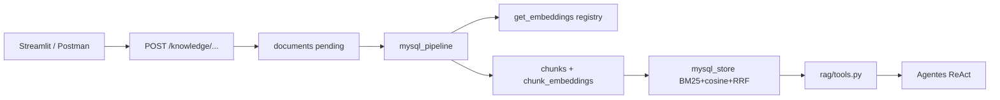
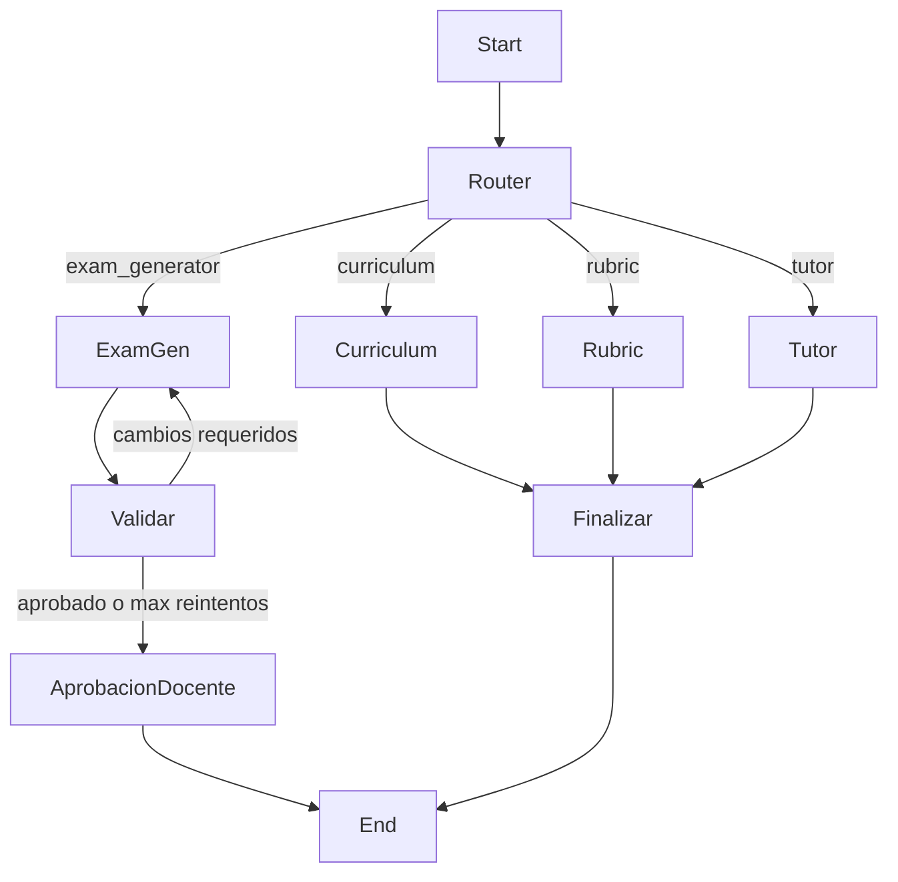
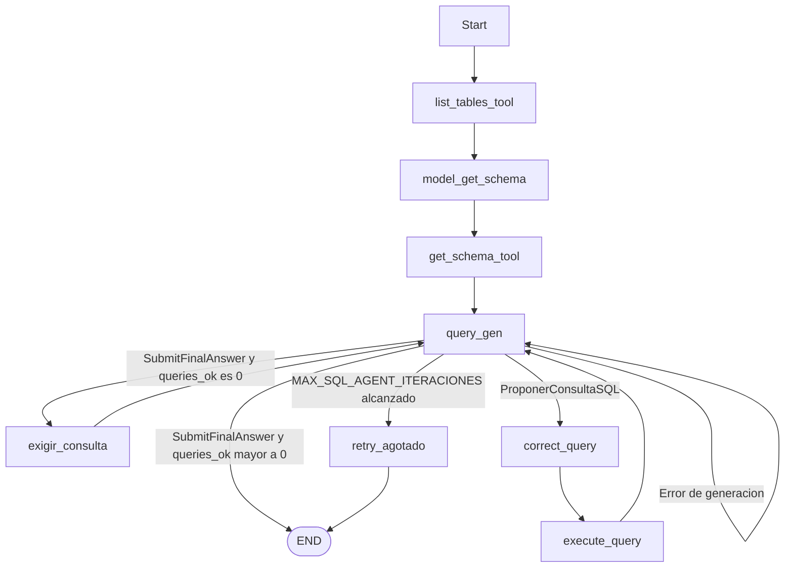

# Implementación — Asistente IA para Educación

Documento técnico de lo construido: código, API JWT, UI Streamlit, Docker y despliegue.
La arquitectura conceptual está en [arquitectura.md](arquitectura.md).

## 1. Qué se implementó

| Capa | Tecnología | Ubicación |
|---|---|---|
| API JWT | FastAPI + Uvicorn | `src/api/` (`src.api.main:app`) |
| UI | Streamlit (cliente HTTP) | `app_streamlit/` |
| Orquestación multi-agente | LangGraph (supervisor + ReAct) | `src/orchestrator/`, `src/agents/` |
| Contratos entre agentes | Pydantic | `src/agents/schemas.py` |
| Conocimiento (RAG) | MySQL: BM25 + embeddings + RRF | `src/ingestion/mysql_pipeline.py`, `src/rag/mysql_store.py` |
| SQL Agent (consultas de negocio) | LangGraph (`StateGraph` a medida, no ReAct) | `src/sql_agent/` |
| Model registry | OpenAI / Ollama vía perfiles | `src/llm/registry.py` |
| Memoria | Checkpointer (sesión) + MySQL (LTM) | LangGraph + `src/memory/` |
| Auth | JWT + bcrypt | `src/api/security.py` |
| CLI legado | `main.py` (+ Chroma opcional) | `main.py`, `src/legacy_chat_api.py` |
| Contenedor | Docker (API + UI) | `Dockerfile`, `docker-compose.yml`, `scripts/remote.sh` |

## 2. Estructura del repositorio

```
Orquestacion-Agentes/
├── app_streamlit/             # UI Streamlit (cliente de la API JWT)
│   ├── Home.py
│   ├── pages/                 # Conocimiento, Asistente, Historial, Aprobaciones
│   └── lib/                   # api_client, session, ui, labels
├── data/                      # Material de ejemplo / seed (CLI legado)
├── docs/
│   ├── arquitectura.md
│   ├── implementacion.md      # Este documento
│   ├── diagramas-secuencia.md
│   └── c4/
├── postman/
├── scripts/                   # init_db, seed_demo_kb, run_test_pipeline, remote.sh
├── src/
│   ├── api/                   # API JWT (auth, knowledge, requests, sql-queries, HITL)
│   ├── agents/                # Curriculum, Exam, Rubric, Tutor + schemas
│   ├── llm/                   # Model registry
│   ├── ingestion/             # mysql_pipeline (+ pipeline Chroma legado)
│   ├── rag/                   # mysql_store, tools, chroma_client (legado)
│   ├── memory/
│   ├── orchestrator/graph.py
│   ├── sql_agent/             # Grafo SQL Agent: validator, executor, database, tools, graph
│   ├── legacy_chat_api.py     # API chat legado /api/v1/* (opcional)
│   └── config.py
├── tests/
├── Dockerfile                 # CMD = API JWT; UI se lanza con otro CMD/contenedor
├── docker-compose.yml         # servicios asistente (:8000) + ui (:8501)
├── main.py
├── requirements.txt
└── .env.example
```

Persistencia **API JWT** (fuente de verdad):

| Almacén | Contenido |
|---|---|
| MySQL | users, documents, chunks, chunk_embeddings, requests, approvals, memoria_*, sql_queries, sql_query_events |
| `storage/logs/` | Trazas JSONL locales (opcional) |

Chroma / `storage/chunks` solo aplican al **CLI / API legado**, no al happy path JWT.

## 3. Flujo de conocimiento (API)

Los agentes en el flujo API **no leen `data/` en caliente**. El conocimiento usable es el de la KB del usuario en MySQL:


```mermaid
flowchart LR
    UI["Streamlit / Postman"] --> API["POST /knowledge/..."]
    API --> Docs["documents pending"]
    Docs --> Pipe["mysql_pipeline"]
    Pipe --> Emb["get_embeddings registry"]
    Pipe --> MySQL["chunks + chunk_embeddings"]
    MySQL --> Hybrid["mysql_store BM25+cosine+RRF"]
    Hybrid --> Tools["rag/tools.py"]
    Tools --> Agents["Agentes ReAct"]
```

### 3.1 Cómo añadir documentación (vía API / Streamlit)

1. Login JWT (`POST /auth/login` o pantalla Home de Streamlit).
2. Crear documento: `POST /knowledge/{indice}/documents` con `filename` + `content_text`  
   (`indice` ∈ `apuntes` | `examenes` | `rubricas` | `curriculo`).
3. Ingestar pendientes: `POST /knowledge/ingest` (o botón en **Conocimiento**).
4. Opcional: `POST /knowledge/documents/{id}/reprocess` tras editar.

Seed demo: `python scripts/seed_demo_kb.py` (usuario `demo@instituto.local` / `demo1234`).

### 3.2 Búsqueda híbrida (MySQL)

Cada tool RAG (`buscar_apuntes`, …):

1. BM25 sobre chunks del `user_id` + índice.
2. Embedding de consulta + coseno solo contra filas con `chunk_embeddings.model` = modelo activo.
3. Fusión RRF (`k=60`).
4. Devuelve trozos con metadatos de fuente.

Si cambias de modelo de embedding (`LLM_PROFILE` / overrides), **reprocesa** la KB para vectores del nuevo modelo (BM25 sigue disponible).

## 4. Orquestación y agentes

Grafo en `src/orchestrator/graph.py`:


```mermaid
flowchart TD
    Start --> Router
    Router -->|curriculum| Curriculum
    Router -->|exam_generator| ExamGen
    Router -->|rubric| Rubric
    Router -->|tutor| Tutor
    ExamGen --> Validar
    Validar -->|aprobado o max reintentos| AprobacionDocente
    Validar -->|cambios requeridos| ExamGen
    Curriculum --> Finalizar
    Rubric --> Finalizar
    Tutor --> Finalizar
    AprobacionDocente --> End
    Finalizar --> End
```

Comportamiento relevante:

- **Alumno** → siempre Tutor (salvaguarda, sin LLM en el router).
- **Examen** → Exam Generator → Rubric (`veredicto.aprobado` tipado) → `interrupt` HITL.
- Contratos: `ExamenGenerado`, `VeredictoValidacion`, `PayloadAprobacion` en `src/agents/schemas.py`.
- **Límite ReAct**: `MAX_ITERACIONES_REACT` en `src/config.py`.
- Chat/embeddings: `src/llm/registry.py` (`get_chat_model`, `get_embeddings`).

## 5. SQL Agent (consultas de negocio en lenguaje natural)

Grafo independiente en `src/sql_agent/graph.py` — no es un agente ReAct (`create_react_agent`)
como los de `src/agents/`, sino un `StateGraph` a medida con su propio loop de
autocorrección SQL:


```mermaid
flowchart TD
    Start --> ListTables[list_tables_tool]
    ListTables --> GetSchemaModel[model_get_schema]
    GetSchemaModel --> GetSchema[get_schema_tool]
    GetSchema --> QueryGen[query_gen]
    QueryGen -->|SubmitFinalAnswer y queries_ok mayor a 0| End([END])
    QueryGen -->|SubmitFinalAnswer y queries_ok es 0| Exigir[exigir_consulta]
    Exigir --> QueryGen
    QueryGen -->|ProponerConsultaSQL| Correct[correct_query]
    QueryGen -->|Error de generacion| QueryGen
    QueryGen -->|MAX_SQL_AGENT_ITERACIONES alcanzado| Retry[retry_agotado]
    Correct --> Execute[execute_query]
    Execute --> QueryGen
    Retry --> End
```

**Endpoint:** `POST /sql-queries` (async, mismo patrón `BackgroundTasks` que `/requests`) ·
**UI:** página **Consultas SQL** · **Acceso:** solo `rol == "docente"`.

Salvaguardas, ninguna depende de que el prompt se cumpla (defensa en profundidad):

1. **Validación AST** (`sql_validator.py`, `sqlglot`): solo `SELECT`; rechaza DML/DDL
   (también anidado en CTE/subquery), tablas con `schema.tabla`, y cualquier tabla fuera
   de la whitelist de la BD de negocio.
2. Sesión MySQL en `SET SESSION TRANSACTION READ ONLY`, independiente del validador.
3. Ejecutor "trust no one" (`executor.py`): revalida la consulta contra la whitelist de
   tablas justo antes de tocar la BD.
4. **Gate de grounding** (`exigir_consulta` + tool `ProponerConsultaSQL`): el grafo cuenta
   `queries_ok` en el estado y rechaza estructuralmente un `SubmitFinalAnswer` sin al menos
   una consulta SQL ejecutada con éxito. Se agregó tras probar el consumo real desde la UI
   (ver §10): `gpt-4o-mini` a veces respondía con un dato inventado en el primer turno.

`AGENT_DB_URI` (BD de negocio, distinta de `DATABASE_URL`) y `MAX_SQL_AGENT_ITERACIONES`
en `.env` (ver §8). Detalle de diseño: [arquitectura.md](arquitectura.md) §6.5.

## 6. API JWT (`src.api.main:app`)

```bash
uvicorn src.api.main:app --reload --port 8000
```

Swagger: `http://127.0.0.1:8000/docs` · Health: `GET /health` (incluye `llm` del registry).

### 6.1 Endpoints

| Método | Ruta | Auth | Descripción |
|---|---|---|---|
| `GET` | `/health` | No | Liveness + selección LLM |
| `POST` | `/auth/register` | No | Alta usuario (`docente` \| `alumno`) |
| `POST` | `/auth/login` | No | JWT Bearer |
| `GET` | `/auth/me` | Sí | Usuario actual |
| `POST` | `/knowledge/{indice}/documents` | Sí | Crear doc `pending` |
| `GET` | `/knowledge/documents` | Sí | Listar |
| `GET/PATCH/DELETE` | `/knowledge/documents/{id}` | Sí | Detalle / editar / borrar |
| `POST` | `/knowledge/ingest` | Sí | Indexar pendientes |
| `POST` | `/knowledge/documents/{id}/reprocess` | Sí | Reprocesar uno |
| `GET` | `/knowledge/chunks` | Sí | Chunks (máx. 200) |
| `POST` | `/requests` | Sí | Arranca job async (202) |
| `GET` | `/requests` | Sí | Listar propias |
| `GET` | `/requests/{id}` | Sí | Detalle + approval |
| `POST` | `/requests/{id}/approve` | Sí + docente | HITL `si`/`no` |
| `GET` | `/requests/{id}/events` | Sí | Event log |
| `POST` | `/sql-queries` | Sí + docente | Pregunta en lenguaje natural a la BD de negocio (202) |
| `GET` | `/sql-queries` | Sí + docente | Listar propias |
| `GET` | `/sql-queries/{id}` | Sí + docente | Detalle + `sql_query` ejecutada + `respuesta_final` |
| `GET` | `/sql-queries/{id}/events` | Sí + docente | Event log nodo a nodo del grafo |

Aislamiento: todo filtrado por `user_id` del JWT.

### 6.2 Solicitudes y HITL

1. `POST /requests` `{ "peticion": "..." }` → `status: running`.
2. Polling `GET /requests/{id}` hasta `completed` | `failed` | `waiting_approval`.
3. Si examen: `POST /requests/{id}/approve` `{ "decision": "si" }` y volver a poll.

### 6.3 API legado

`src.legacy_chat_api:app` — rutas `/api/v1/health`, `/chat`, `/approve`, `/ingestar`.  
Queda como camino opcional (CLI / demos antiguas). El **Dockerfile, Compose y VPS**
sirven la API JWT (`src.api.main:app`).

## 7. UI Streamlit

Cliente HTTP puro (no importa LangGraph ni RAG):

```bash
# Terminal 1
uvicorn src.api.main:app --reload --port 8000

# Terminal 2
streamlit run app_streamlit/Home.py
```

| Página | Función |
|---|---|
| Home | Login / registro; CTA al Asistente; aviso de pendientes HITL |
| Conocimiento | Material con labels humanos, indexar, confirmar borrado |
| Asistente | Form + polling con barra de progreso; approve inline (docente) |
| Historial | Filtro por estado; reanudar `running`; atajos accionables |
| Aprobaciones | Contador en menú; confirmar antes de decidir |
| Consultas SQL | Solo `docente`: pregunta a la BD de negocio, ver SQL ejecutada y pasos del grafo |

UX relevante:

- Tras autenticar, el **sidebar** muestra modelo activo (`GET /health`) y navegación
  (con badge de pendientes en Aprobaciones).
- El polling del Asistente explica la espera, muestra fases y progreso aproximado.
- Estado `waiting_approval`: decidir **inline** en el resultado o en Aprobaciones.
- Acciones destructivas / HITL requieren confirmación (checkbox + botón).

Módulos: `app_streamlit/lib/` (`api_client`, `session`, `ui`, `labels`).

`STREAMLIT_API_BASE_URL`:

| Entorno | Valor típico |
|---|---|
| Local (venv) | `http://127.0.0.1:8000` |
| Compose / VPS (red Docker) | `http://asistente:8000` o `http://asistente-ia-educacion:8000` |

## 8. Variables de entorno

Ver `.env.example`. Claves:

| Variable | Uso |
|---|---|
| `DATABASE_URL` | MySQL de metadatos de la app (SQLAlchemy) |
| `AGENT_DB_URI` | BD de negocio que consulta el SQL Agent (usuario solo-lectura recomendado) |
| `MAX_SQL_AGENT_ITERACIONES` | Límite del loop de autocorrección del SQL Agent (default 10) |
| `JWT_SECRET`, `JWT_EXPIRE_MINUTES` | Auth |
| `CORS_ORIGINS` | CORS API |
| `LLM_PROFILE` | `cloud_openai` \| `vllm_usfq` \| `local_barato` \| `local_calidad` |
| `LLM_BASE_URL` / `EMBEDDING_BASE_URL` | URLs separadas para APIs OpenAI-compatible |
| `LLM_*` / `EMBEDDING_*` / `OPENAI_COMPAT_API_KEY` / `OLLAMA_BASE_URL` | Overrides del perfil |
| `OPENAI_API_KEY` | Perfil cloud / provider openai |
| `STREAMLIT_API_BASE_URL` | Base URL del cliente Streamlit |
| `LANGCHAIN_*` | LangSmith opcional |
| `SSH_*`, `DEPLOY_PATH`, `API_BASE_URL`, `DOCKER_IMAGE` | Despliegue VPS |
| `CONTAINER_NAME`, `UI_CONTAINER_NAME`, `DOCKER_NETWORK` | Nombres de contenedores / red en VPS |

Dependencias de auth en imagen: `python-jose`, `passlib`, `bcrypt` (ver `requirements.txt`).

Bootstrap:

```bash
python scripts/init_db.py
python scripts/seed_demo_kb.py
```

### 8.1 Switch OpenAI pagado ↔ vLLM USFQ

El cambio se realiza únicamente con `LLM_PROFILE`; agentes, orquestador y contratos
Pydantic siguen consumiendo `get_chat_model()` / `get_embeddings()`.

```env
# OpenAI pagado
LLM_PROFILE=cloud_openai

# vLLM USFQ (requiere VPN; solo HTTP)
LLM_PROFILE=vllm_usfq
LLM_BASE_URL=http://172.28.230.10:12555/v1
EMBEDDING_BASE_URL=http://172.28.230.10:12556/v1
OPENAI_COMPAT_API_KEY=local
```

Verifica model IDs y conectividad con `python scripts/smoke_vllm_usfq.py`.
Al cambiar de embedding, reprocesa la KB; el retriever filtra por modelo y no mezcla
vectores incompatibles.

## 9. Docker y VPS

### 9.1 Imagen / Compose

- Base: `python:3.13-slim`
- CMD por defecto: API JWT `uvicorn src.api.main:app --host 0.0.0.0 --port 8000`
- Puertos de imagen: `8000` (API) y `8501` (UI, otro contenedor/CMD)
- Compose (`docker-compose.yml`): dos servicios en red `asistente-net`

| Servicio | Contenedor | Puerto | Memoria | Comando |
|---|---|---|---|---|
| `asistente` | `asistente-ia-educacion` | `8000` | 700m | API JWT |
| `ui` | `asistente-ia-ui` | `8501` | 400m | `streamlit run app_streamlit/Home.py` |

```bash
docker compose up -d --build
curl http://localhost:8000/health
# UI: http://localhost:8501
```

En Compose, `STREAMLIT_API_BASE_URL=http://asistente:8000` (nombre del servicio).
El SQL Agent corre **en el mismo contenedor API**; si se usa, `AGENT_DB_URI` debe estar
en el `.env` que lee ese servicio (no necesita un contenedor propio).

### 9.2 Despliegue remoto

Helper: `./scripts/remote.sh deploy|build|push-image|rsync|restart|health`.

El VPS tiene poca RAM: **build local** → `docker save | ssh docker load`.  
`deploy` / `restart` recrean **API + UI** en la red `asistente-net` y fuerzan
`STREAMLIT_API_BASE_URL=http://asistente-ia-educacion:8000` en el contenedor UI.

```bash
./scripts/remote.sh deploy
./scripts/remote.sh health
# API: GET http://SSH_HOST:8000/health
# UI:  http://SSH_HOST:8501  (HTTP 200)
```

Solo `.env` o arranque (sin rebuild):

```bash
./scripts/remote.sh restart
```

Variables de despliegue: `SSH_HOST`, `SSH_USER`, `SSH_PASSWORD`, `DEPLOY_PATH`,
`API_BASE_URL`, `DOCKER_IMAGE`, `CONTAINER_NAME`, `UI_CONTAINER_NAME`, `DOCKER_NETWORK`.

## 10. Pruebas

```bash
# Unitarios / contratos / registry
pytest tests/test_llm_registry.py tests/test_schemas_contratos.py -v

# SQL Agent: validador AST (puro, sin LLM/BD) + grafo + API (requieren OPENAI_API_KEY)
pytest tests/test_sql_validator.py tests/test_sql_agent_graph.py tests/test_sql_agent_api.py -v

# Smoke API (requiere MySQL + .env)
python scripts/run_test_pipeline.py
```

Postman: [`postman/Asistente-IA-Educacion.postman_collection.json`](../postman/Asistente-IA-Educacion.postman_collection.json)  
(puede incluir rutas legado `/api/v1/*`; para JWT usar Swagger `/docs` o Streamlit).

### 10.1 Verificación manual del SQL Agent en el navegador

Probar el grafo solo con pytest no detecta todo: el LLM puede comportarse distinto en
la práctica (parallel tool-calling, respuestas sin evidencia). Se verificó levantando
API + Streamlit reales y automatizando Chromium (Playwright) con un docente autenticado
haciendo una pregunta real contra una BD SQLite de prueba. Esa corrida encontró y llevó a
corregir el gate de grounding (`exigir_consulta` / `ProponerConsultaSQL`, ver §5 y
[arquitectura.md](arquitectura.md) §6.5) antes de darlo por completo.

## 11. CLI local (legado)

```bash
python main.py ingestar
python main.py demo
python main.py docente "Estructura la unidad de electricidad"
python main.py alumno "¿Qué es la ley de Ohm?" alumno-042
```

Usa índices Chroma/`data/`; no sustituye la KB MySQL por usuario de la API JWT.

## 12. Limitaciones conocidas del MVP

- PDFs vía API: hoy el alta es texto (`content_text`); OCR no incluido.
- Examen aprobado se guarda en memoria LTM; reindexación automática en `examenes` pendiente.
- Checkpointer `MemorySaver` in-process: se pierde al reiniciar el proceso API (HITL
  entre reinicios no se reanuda).
- Un worker Uvicorn; cargas concurrentes pesadas no recomendadas en VPS pequeño
  (API ~700m + UI ~400m).
- Streamlit no se sirve detrás de TLS/reverse proxy en el script actual (HTTP plano).
- SQL Agent: una única `AGENT_DB_URI` institucional por defecto (override por request
  posible, no expuesto aún en la UI); sin selección semántica de tablas (schema linking)
  para esquemas de negocio muy grandes — hoy lista todas las tablas y deja elegir al modelo.

## 13. Relación con la documentación de arquitectura

| Directriz ([arquitectura.md](arquitectura.md)) | Dónde está en código |
|---|---|
| Supervisor + ReAct | `src/orchestrator/graph.py`, `src/agents/base.py` |
| Contratos Pydantic | `src/agents/schemas.py` |
| RAG MySQL multi-índice | `src/ingestion/mysql_pipeline.py`, `src/rag/mysql_store.py` |
| Model registry | `src/llm/registry.py` |
| Human-in-the-loop | nodo `aprobacion_docente` + `POST /requests/{id}/approve` |
| Cliente UI | `app_streamlit/` |
| Memoria corto/largo plazo | checkpointer LangGraph + `src/memory/` |
| SQL Agent + validación AST | `src/sql_agent/graph.py`, `sql_validator.py`, `executor.py` |
