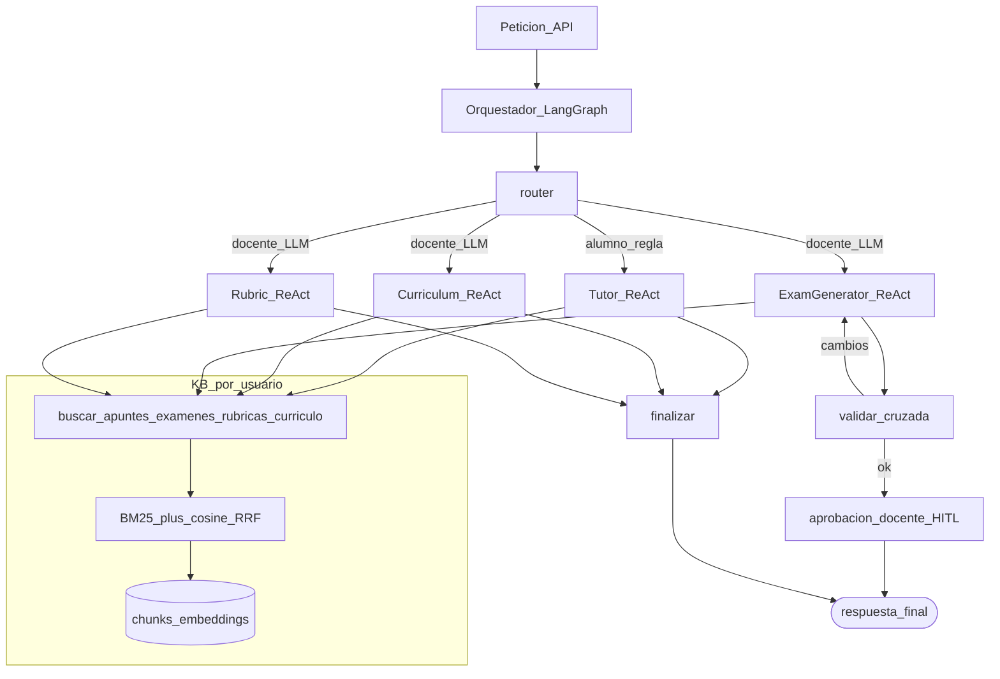
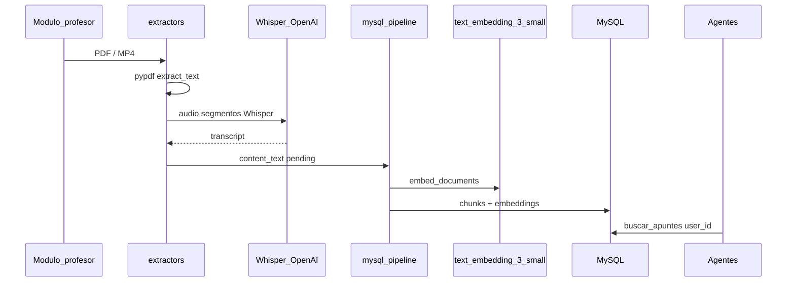

# Revisión de implementación e interacción de agentes

**Generado (UTC):** 2026-09-16T03:29:14.381078+00:00
**Resultado global:** PASS

## 1. Checks

| Check | OK | Detalle |
|---|---|---|
| `model_registry` | ✅ | profile=cloud_openai llm=gpt-4o-mini emb=text-embedding-3-small |
| `ffmpeg` | ✅ | /Users/peluchito/Desktop/Orquestacion-Agentes/.venv/lib/python3.13/site-packages/imageio_ffmpeg/binaries/ffmpeg-macos-x86_64-v7.1 |
| `extractors_modules` | ✅ | pdf/video/module_media/cost_estimate importables |
| `demo_user` | ✅ | id=1 rol=docente |
| `modulo_indexed` | ✅ | 2 docs del módulo; indexed=True |
| `retriever_apuntes` | ✅ | len=4333 t=9.71s |
| `agent:alumno_tutor_finanzas` | ✅ | nodos=['router', 'tutor', 'finalizar'] destino=tutor t=7.87s |
| `agent:docente_curriculum_finanzas` | ✅ | nodos=['router', 'curriculum', 'finalizar'] destino=curriculum t=7.72s |

## 2. Flujo de agentes (implementación)



## 3. Pipeline de medios (PDF / vídeo)



## 4. Trazas de esta corrida

### `alumno_tutor_finanzas`
- Nodos: `['router', 'tutor', 'finalizar']`
- Destino: `tutor`
- Preview: En el contexto de Finanzas Estratégicas, es importante distinguir entre **costo de operación** y **costo de producción**, ya que ambos conceptos son fundamentales para la gestión financiera de una empresa.  ### Costo de Operación El costo de operación se refiere a todos los gastos necesarios para llevar a cabo las actividades diarias de una empresa. Esto incluye no solo los costos directos relacio

### `docente_curriculum_finanzas`
- Nodos: `['router', 'curriculum', 'finalizar']`
- Destino: `curriculum`
- Preview: ### Unidad Introductoria de Finanzas Estratégicas  #### Sesión 1: Introducción a las Finanzas - **Objetivo**: Comprender la importancia de las finanzas en la toma de decisiones empresariales. - **Contenidos**:    - Definición de finanzas.   - Importancia de las finanzas en la gestión empresarial.   - Funciones básicas de las finanzas. - **Materiales**: Guía didáctica de Finanzas Estratégicas [fuen

## 5. Cómo reproducir

```bash
python scripts/transcribe_and_index_module.py
python scripts/review_agents_pipeline.py --write-doc
```
